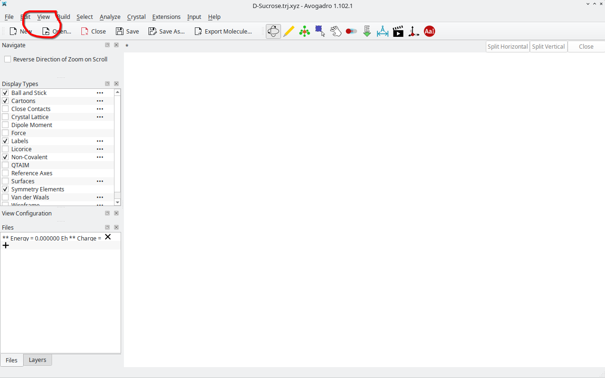
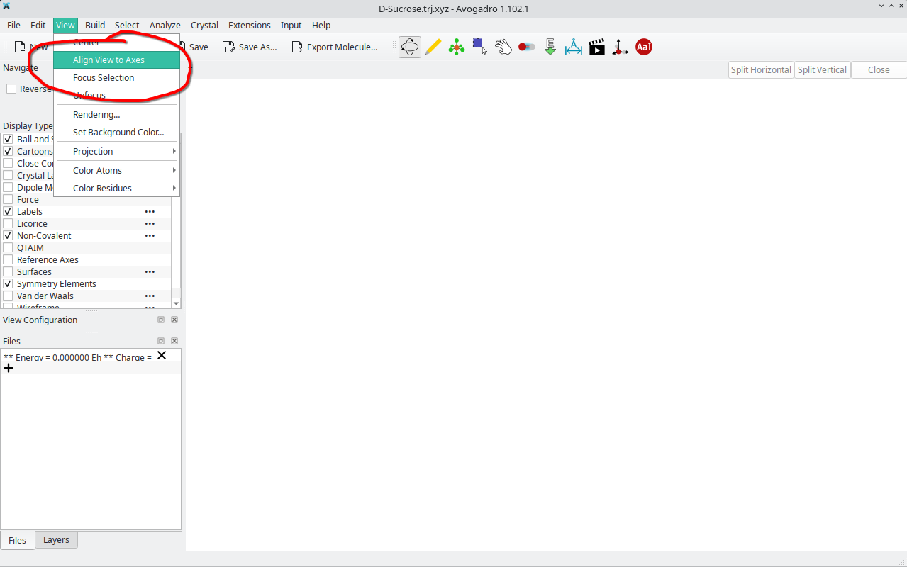
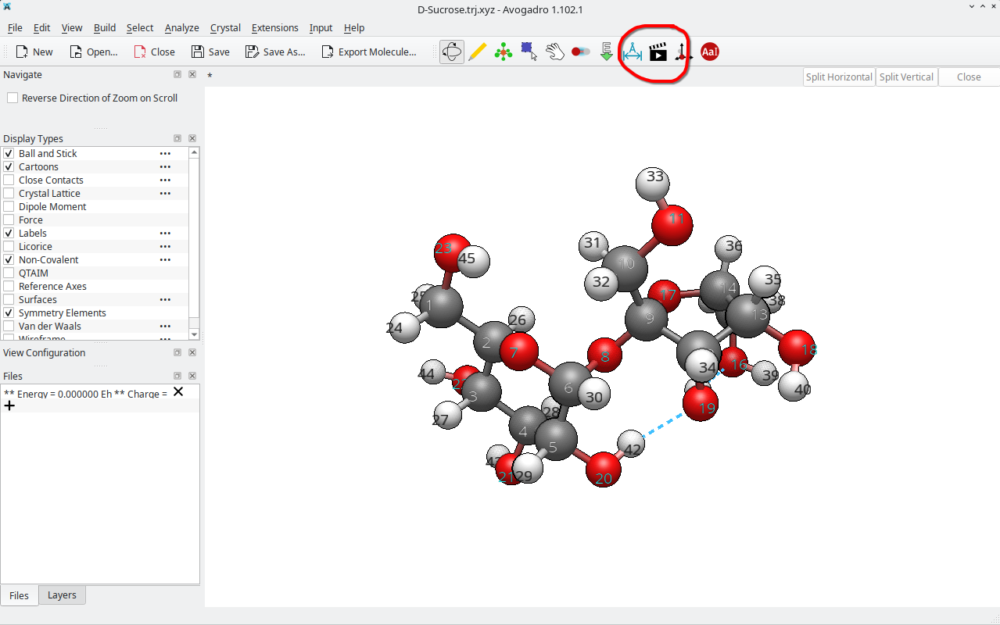
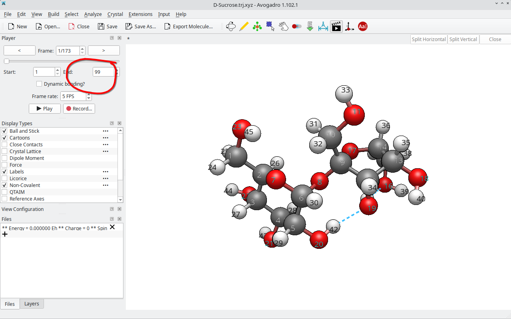
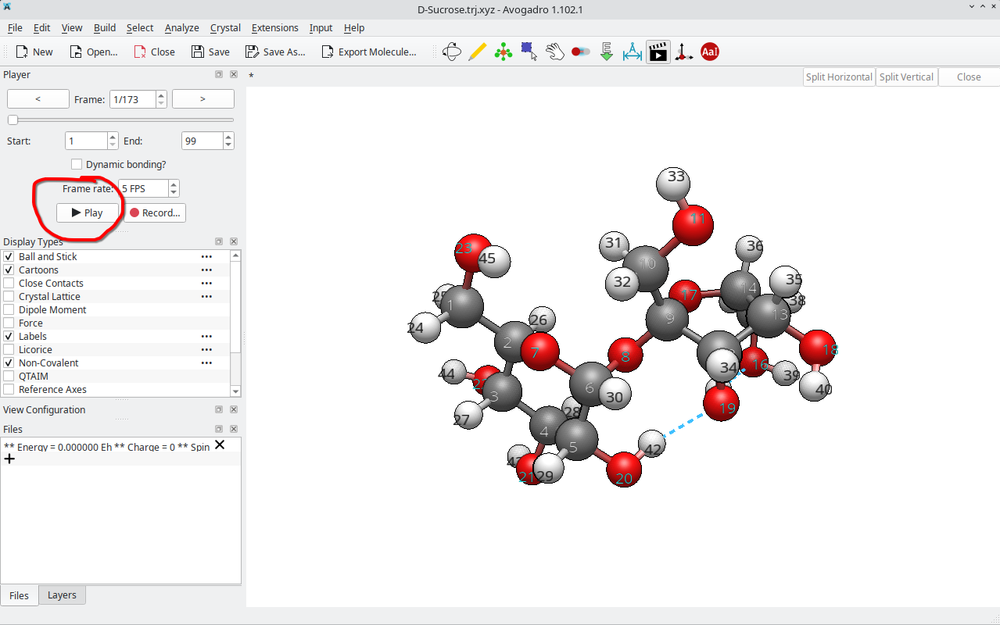
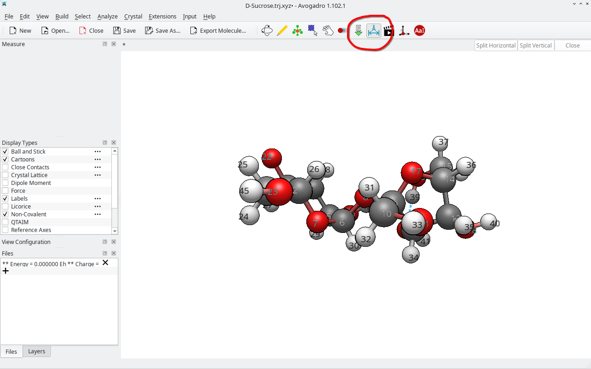

<!--
author: Molecular Modelling Course Team
language: en
narrator: US English Female
version: 1.0

Session 1: Geometry Optimization
Part of: Molecular Modelling and Quantum Chemistry (Master)
-->

# Session 1: Geometry Optimization

## Your First Steps into Molecular Modelling

> **Welcome to Session 1!**
>
> In this session, you will learn what **geometry optimization** means, 
> why it matters, and how to perform it on real molecules.
>
> You will optimize **sugars** and **peptides** using different methods 
> and compare the results. All materials are self-contained — 
> you can work through this at your own pace.

---

## 🎯 Learning Objectives

By the end of this session, you will:

- ✅ Understand **geometry optimization** from first principles
- ✅ Know the difference between **force fields** (UFF vs. GFN-FF)
- ✅ Use **Curcuma** to optimize molecular structures
- ✅ Analyze results: **RMSD**, **energy changes**, **structural changes**
- ✅ Interpret optimization trajectories in **Avogadro**
- ✅ Compare optimization across **different methods**

---

## Part 1️⃣: Concept — Geometry Optimization from the Beginning

### What is Geometry Optimization?

**Geometry optimization** is the process of finding the **minimum energy configuration** of a molecule by adjusting atomic positions.

Think of it like this — here's an **interactive example**:

##### 📊 `Potential Energy Surface (PES): Double-Well Potential`

**Barrier Height:** <script modify="false" input="range" step="0.5" min="0.1" max="10" value="3" output="barrier">@input</script>

**Starting Position:** <script modify="false" input="range" step="0.1" min="-3" max="3" value="-2" output="startpos">@input</script>

**Asymmetry (Depth Difference):** <script modify="false" input="range" step="0.1" min="0" max="3" value="0.5" output="asymmetry">@input</script>

<script run-once style="display: inline-block; width: 100%">
function doubleWellPES(barrier, asymmetry) {
  let data = [];
  for (let x = -3; x <= 3; x += 0.05) {
    // Double-well potential: E(x) = x^4 - barrier*x^2 + asymmetry*x
    let E = Math.pow(x, 4) - barrier * Math.pow(x, 2) + asymmetry * x;
    data.push([x, E]);
  }
  return data;
}

function findNearestMinimum(startPos, barrier, asymmetry) {
  // Simple gradient descent to find which minimum is reached
  let x = startPos;
  let step = 0.01;

  for (let i = 0; i < 1000; i++) {
    // Gradient: dE/dx = 4x^3 - 2*barrier*x + asymmetry
    let gradient = 4 * Math.pow(x, 3) - 2 * barrier * x + asymmetry;

    if (Math.abs(gradient) < 0.001) break;

    x = x - step * gradient;
    if (x < -3.5 || x > 3.5) break;
  }

  return x;
}

let barrier = @input(`barrier`);
let startpos = @input(`startpos`);
let asymmetry = @input(`asymmetry`);

let pesData = doubleWellPES(barrier, asymmetry);
let convergedX = findNearestMinimum(startpos, barrier, asymmetry);
let convergedE = Math.pow(convergedX, 4) - barrier * Math.pow(convergedX, 2) + asymmetry * convergedX;
let startE = Math.pow(startpos, 4) - barrier * Math.pow(startpos, 2) + asymmetry * startpos;

// Calculate minima and their energies
let minima = [-Math.sqrt(barrier/2), Math.sqrt(barrier/2)];
let minimaEnergies = minima.map(x => Math.pow(x, 4) - barrier * Math.pow(x, 2) + asymmetry * x);

// Automatically classify as global or local based on actual energy value
let globalMinIdx = minimaEnergies[0] < minimaEnergies[1] ? 0 : 1;
let localMinIdx = globalMinIdx === 0 ? 1 : 0;

let globalMinX = minima[globalMinIdx];
let globalMinE = minimaEnergies[globalMinIdx];
let localMinX = minima[localMinIdx];
let localMinE = minimaEnergies[localMinIdx];

let option = {
  title: {
    text: 'Geometry Optimization on a Double-Well PES',
    left: 'center'
  },
  grid: { top: 80, left: 60, right: 40, bottom: 100 },
  xAxis: {
    name: 'Reaction Coordinate',
    type: 'value',
    min: -3,
    max: 3,
    axisLabel: { fontSize: 12 }
  },
  yAxis: {
    name: 'Potential Energy (kcal/mol)',
    type: 'value',
    axisLabel: { fontSize: 12 }
  },
  series: [
    {
      name: 'PES',
      type: 'line',
      data: pesData,
      lineStyle: { color: '#333', width: 2 },
      showSymbol: false,
      smooth: true
    },
    {
      name: 'Global Minimum',
      type: 'scatter',
      data: [[globalMinX, globalMinE]],
      symbolSize: 12,
      itemStyle: { color: '#2ecc71' }
    },
    {
      name: 'Local Minimum',
      type: 'scatter',
      data: [[localMinX, localMinE]],
      symbolSize: 12,
      itemStyle: { color: '#3498db' }
    },
    {
      name: 'Start Position',
      type: 'scatter',
      data: [[startpos, startE]],
      symbolSize: 10,
      itemStyle: { color: '#e74c3c' }
    },
    {
      name: 'Converged Position',
      type: 'scatter',
      data: [[convergedX, convergedE]],
      symbolSize: 12,
      itemStyle: { color: '#f39c12', borderColor: '#000', borderWidth: 2 }
    }
  ],
  legend: {
    orient: 'horizontal',
    bottom: 10
  }
};

"HTML: <lia-chart option='" + JSON.stringify(option) + "'></lia-chart>"
</script>

**What happens:**

- **Red dot**: Your starting geometry (arbitrary positions)
- **Orange dot with border**: Where optimization converges (nearest minimum)
- **Blue dot**: Local minimum (stuck here if barrier is high!)
- **Green dot**: Global minimum (lowest energy, most stable)

**Try this:** Drag the "Starting Position" slider from left (-2) to right (+2). Watch how the optimization sometimes gets trapped in the **local minimum** (blue), and sometimes finds the **global minimum** (green)!

**Key insight:** *Geometry optimization always finds the nearest minimum, not necessarily the global one. The starting geometry determines which minimum you get!*

---

### Why Do We Optimize Geometries?

1. **Experimental relevance:** Molecules naturally adopt low-energy conformations
2. **Accurate starting point:** For MD simulations, energy calculations, reactivity
3. **Structure determination:** We need realistic 3D coordinates
4. **Energy comparison:** Only meaningful when both structures are optimized

**Real-world example:** A protein in solution adopts a structure that minimizes its free energy. Before running a 100 ns MD simulation, we want to start from a realistic geometry.

---

### The Born-Oppenheimer (BO) Approximation

Geometry optimization relies on the **Born-Oppenheimer Approximation**:

> *Nuclei move slowly compared to electrons. We can calculate electronic energy at fixed nuclear positions, then use that energy to guide nuclear motion.*

**In practice:**

- Fix atomic positions → Calculate forces on each atom
- Move atoms in direction of forces (downhill in energy)
- Repeat until forces are near zero (converged)

**Key insight:** The energy surface is the **same for all methods** (UFF, GFN-FF, etc.), but they calculate it differently.

### ✅ Quick Check 1: BO Approximation

What does the Born-Oppenheimer approximation assume?

- [[X]] Nuclei move slowly compared to electrons, so we can decouple them
- [[ ]] Electrons and nuclei move at the same speed
- [[ ]] Nuclear motion doesn't affect electronic structure
- [[ ]] The energy surface has no local minima
********************

**Why decoupling works:**

Electrons are ~2000× lighter than nuclei, so they respond nearly instantaneously to nuclear positions. This allows us to:
1. Fix nuclei at specific positions
2. Calculate electronic energy
3. Use that energy to find optimal nuclear positions

This **drastically reduces** computational cost! Instead of solving electron + nucleus motion together (intractable), we solve them sequentially.

**Key insight:** This approximation is valid for most molecules at room temperature. Exceptions: very high temperatures, nuclear tunneling effects.

********************

<details>
<summary>💡 Need a hint?</summary>

Think about the masses: electrons are much ligher than nuclei. Which implication does this have?

</details>

---

### Convergence Criteria

Optimization stops when these criteria are met:

| Criterion | Meaning | Typical Threshold |
|-----------|---------|-------------------|
| **Energy change** (dE) | Final energy doesn't change much | < 0.1 kcal/mol |
| **RMSD** (Atomic movement) | Atoms barely move between steps | < 0.01 Å |
| **Gradient norm** | Forces on atoms are nearly zero | < 0.001 kcal/(mol·Å) |

**All three must be satisfied** for a robust optimization.

---

### 🔬 Advanced: Realistic Multi-Minima Energy Surfaces

Real molecules don't have simple double-well potentials. They have **complex landscapes with many local minima**. Here's what real geometry optimization looks like:

##### 📊 `Multi-Minima PES Example with Multiple Optimization Paths`

**PES example:** <script modify="false" input="range" step="1" min="3" max="8" value="5" output="numminima">@input</script>

**Landscape Roughness:** <script modify="false" input="range" step="0.1" min="0.5" max="3" value="1.5" output="roughness">@input</script>

**Number of Starting Geometries:** <script modify="false" input="range" step="1" min="1" max="5" value="3" output="numbaths">@input</script>

<script run-once style="display: inline-block; width: 100%">
// ==================== ENERGY SURFACE FUNCTION ====================
// Define PES as a mathematical function (deterministic!)
function pesFunction(x, minimaPos, minimaDepth, roughness) {
  let E = 0;
  // Multiple Gaussian wells (centered at minimaPos with depths minimaDepth)
  for (let i = 0; i < minimaPos.length; i++) {
    E -= minimaDepth[i] * Math.exp(-Math.pow(x - minimaPos[i], 2) / 0.5);
  }
  // Add roughness for realistic landscape
  E += roughness * Math.sin(x * 2) * Math.cos(x * 1.3);
  return E;
}

// ==================== DETERMINISTIC MINIMA GENERATION ====================
function generateDeterministicMinima(numMinima, roughness) {
  // Minima equally spaced across [0, 10]
  let minimaPos = [];
  for (let i = 0; i < numMinima; i++) {
    minimaPos.push(0.5 + i * (9 / (numMinima - 1)));
  }

  // Depths: deterministic function (not random!)
  // Use sine wave to vary depths in a reproducible way
  let minimaDepth = [];
  for (let i = 0; i < numMinima; i++) {
    let depth = 2.5 + 1.5 * Math.sin(i * Math.PI / (numMinima - 1));
    minimaDepth.push(Math.abs(depth)); // Ensure positive
  }

  return { minimaPos, minimaDepth };
}

// ==================== GRADIENT DESCENT OPTIMIZATION ====================
function optimizeAlongPES(startX, minimaPos, minimaDepth, roughness, maxSteps = 500) {
  let x = startX;
  let stepSize = 0.02;
  let path = [];

  // Track the optimization path
  for (let step = 0; step < maxSteps; step++) {
    let E = pesFunction(x, minimaPos, minimaDepth, roughness);
    path.push([x, E]);

    // Numerical gradient: dE/dx ≈ (E(x+h) - E(x-h)) / (2h)
    let h = 0.001;
    let E_plus = pesFunction(x + h, minimaPos, minimaDepth, roughness);
    let E_minus = pesFunction(x - h, minimaPos, minimaDepth, roughness);
    let gradient = (E_plus - E_minus) / (2 * h);

    // Convergence criterion: gradient nearly zero
    if (Math.abs(gradient) < 0.001) break;

    // Gradient descent step: x_new = x_old - stepSize * (dE/dx)
    x = x - stepSize * gradient;

    // Boundary check
    if (x < 0 || x > 10) {
      x = Math.max(0, Math.min(10, x));
      break;
    }
  }

  // Final energy
  let finalE = pesFunction(x, minimaPos, minimaDepth, roughness);
  path.push([x, finalE]);

  return { convergedX: x, convergedE: finalE, path };
}

// ==================== MAIN CALCULATION ====================
let numMinima = Math.max(3, @input(`numminima`));
let roughness = @input(`roughness`);
let numPaths = @input(`numbaths`);

// Generate deterministic minima
let minimaInfo = generateDeterministicMinima(numMinima, roughness);
let minimaPos = minimaInfo.minimaPos;
let minimaDepth = minimaInfo.minimaDepth;

// Generate PES data points for visualization
let pesData = [];
for (let x = 0; x <= 10; x += 0.05) {
  pesData.push([x, pesFunction(x, minimaPos, minimaDepth, roughness)]);
}

// Find true minima by optimizing from each minima position
let trueMinima = [];
for (let i = 0; i < minimaPos.length; i++) {
  let opt = optimizeAlongPES(minimaPos[i], minimaPos, minimaDepth, roughness, 200);
  trueMinima.push({
    x: opt.convergedX,
    E: opt.convergedE,
    originalIdx: i
  });
}

// Sort by energy to identify global minimum
trueMinima.sort((a, b) => a.E - b.E);
let globalMinimum = trueMinima[0];
let localMinima = trueMinima.slice(1);

// Generate fixed, equally spaced starting positions
let startPositions = [];
for (let i = 0; i < numPaths; i++) {
  startPositions.push(0.5 + i * (9 / Math.max(1, numPaths - 1)));
}

// Colors for different optimization paths
let pathColors = ['#e74c3c', '#9b59b6', '#f39c12', '#1abc9c', '#34495e'];

// Build chart series
let series = [
  {
    name: 'PES',
    type: 'line',
    data: pesData,
    lineStyle: { color: '#333', width: 2.5 },
    showSymbol: false,
    smooth: true,
    z: 1
  }
];

// Add global minimum
series.push({
  name: 'Global Minimum',
  type: 'scatter',
  data: [[globalMinimum.x, globalMinimum.E]],
  symbolSize: 16,
  itemStyle: { color: '#2ecc71' },
  z: 10
});

// Add local minima
for (let i = 0; i < localMinima.length; i++) {
  series.push({
    name: `Local Minimum ${i + 1}`,
    type: 'scatter',
    data: [[localMinima[i].x, localMinima[i].E]],
    symbolSize: 11,
    itemStyle: { color: '#3498db' },
    z: 9
  });
}

// Optimize from each starting position and visualize
for (let i = 0; i < startPositions.length; i++) {
  let startX = startPositions[i];
  let startE = pesFunction(startX, minimaPos, minimaDepth, roughness);
  let opt = optimizeAlongPES(startX, minimaPos, minimaDepth, roughness);

  // Add optimization path as dashed line
  series.push({
    name: `Path ${i + 1} (optimization trajectory)`,
    type: 'line',
    data: opt.path,
    lineStyle: { color: pathColors[i % pathColors.length], width: 1.5, type: 'dashed' },
    showSymbol: false,
    smooth: true,
    z: 2
  });

  // Add starting point
  series.push({
    name: `Start ${i + 1}`,
    type: 'scatter',
    data: [[startX, startE]],
    symbolSize: 8,
    itemStyle: { color: pathColors[i % pathColors.length], opacity: 0.6 },
    z: 4
  });

  // Add converged point
  series.push({
    name: `End ${i + 1}`,
    type: 'scatter',
    data: [[opt.convergedX, opt.convergedE]],
    symbolSize: 12,
    itemStyle: { color: pathColors[i % pathColors.length], borderWidth: 2, borderColor: '#000' },
    z: 5
  });
}

let option = {
  title: {
    text: 'Real Geometry Optimization: Multiple Starting Points on Complex PES',
    left: 'center'
  },
  grid: { top: 80, left: 70, right: 40, bottom: 100 },
  xAxis: {
    name: 'Reaction Coordinate',
    type: 'value',
    min: 0,
    max: 10,
    axisLabel: { fontSize: 11 }
  },
  yAxis: {
    name: 'Potential Energy (kcal/mol)',
    type: 'value',
    axisLabel: { fontSize: 11 }
  },
  series: series,
  legend: {
    orient: 'horizontal',
    bottom: 10,
    textStyle: { fontSize: 9 }
  }
};

"HTML: <lia-chart option='" + JSON.stringify(option) + "'></lia-chart>"
</script>

**What you see:**

- **Black curve**: The complex molecular energy surface with realistic multiple minima
- **🟢 Green dot**: Global minimum (lowest energy = most stable conformation)
- **🔵 Blue dots**: Local minima (stable, but higher energy than global minimum)
- **Dashed lines**: Actual optimization paths (showing gradient descent following the PES!)
- **Light dots**: Starting positions (initial geometries)
- **Filled dots with borders**: Where each optimization converges

**How it works:**

1. **Deterministic PES**: The landscape is reproducible—adjust sliders smoothly without jumps
2. **True gradient descent**: Each colored dashed line shows the actual optimization algorithm moving downhill in energy
3. **Global vs. Local**: The algorithm finds the **nearest minimum**, not necessarily the **lowest minimum**

**Key observations:**

- 🔴 **Try this:** Increase "Number of Starting Geometries" and watch different paths converge to different minima
- 📍 **Try this:** Increase "Landscape Roughness" and see more complex optimization trajectories
- ⚠️ **The problem:** Some starting points find the global minimum (green), others get trapped in local minima (blue)

**This is why:**

- We try multiple optimization methods (UFF, GFN-FF, etc.)
- We use conformational searching to explore different starting geometries
- We always compare results from different starting points
- **For real molecules with 100s of atoms, there could be 1000s of local minima!**

### ✅ Quick Check 2: Convergence

An optimization is converged when:

- [[X]] Energy, atomic movement, and forces are all below thresholds
- [[ ]] Energy stops changing completely
- [[ ]] Only one criterion is satisfied
- [[ ]] Maximum iterations is reached
********************

**Why all three criteria matter:**

Each criterion catches different problems:

- **Energy change (dE):** Ensures energy is stable
- **Atomic movement (RMSD):** Ensures atoms have stopped moving significantly
- **Gradient norm:** Ensures forces are truly zero

**Example:** A poorly converged optimization might have:

- ✅ Low energy change
- ❌ But atoms still moving (high RMSD)
- ❌ And large forces remaining

Checking **only one** would miss these problems!

**In practice:** All major codes (Gromacs, VASP, etc.) require all three for "converged."

********************

<details>
<summary>💡 Need a hint?</summary>

Think: if only energy matters, atoms could still be moving. If only movement matters, forces could still be large. Why do we need ALL three?

</details>

---

### ✅ Quick Check 11: Reproducibility and Local Minima

You optimized the same glucose molecule twice from different starting geometries and got final energies of -320 and -315 kcal/mol. What does this mean?

- [[X]] Different starting geometries led to different local minima (both are valid!)
- [[ ]] One optimization definitely failed and should be discarded
- [[ ]] UFF is unreliable and shouldn't be used for sugars
- [[ ]] This is impossible—force fields are deterministic
********************

**What's happening:**

Force fields **are deterministic** (same input → same output), but optimization **converges to the nearest minimum, not the global one**:

1. Starting geometry A → converges to local minimum at -320 kcal/mol
2. Starting geometry B → converges to different local minimum at -315 kcal/mol
3. Both are **stable structures** (gradient ≈ 0), but different conformations!

**Real example:** Glucose can adopt **chair vs. boat conformations**. Both are minima, but different energies. The chair form (-320) is more stable than the boat form (-315).

**Best practice:**

- Always run multiple optimizations from different starting points or perform sophisticated conformational search
- Compare energies (lowest = likely global minimum)
- Check structures visually (same or different conformations?)
- This is **not a failure**—it's essential validation!

********************

<details>
<summary>💡 Need a hint?</summary>

Think back to the interactive PES visualization—what happened when you changed starting positions?

</details>
---

## Part 2️⃣: Methods — UFF vs. GFN-FF

### Force Fields: What Are They?

A **force field** is a mathematical model that calculates molecular energy based on atomic positions. It's **fast** but **approximate**.

General form:

```
E_total = E_bonds + E_angles + E_dihedrals + E_nonbonded + ...
```

Each term describes how atoms interact.

---

### Method 1: UFF (Universal Force Field)

**UFF** = Universal Force Field

- **Type:** Classical force field
- **Speed:** Fast -> curcuma has better threading/parallel support for UFF
- **Accuracy:** Limited (use GFN-FF when possible)

> ⚠️ **Note:** GFN-FF is the recommended default method. Use UFF only in these specific cases:

**When to use UFF:**

- In case GFN-FF is not available, for example if curcuma was compilied without GFN-FF support
- Avogadro/obabel has UFF and MMFF94s support. 

  - Use MMFF94s for organic molecules. It incldues dispersion and hydrogen bond corrections.
  - Use UFF if MMFF94s reports, Force Field generation failed. Why could this happen?
  
**Limitations:**

- No quantum effects
- Fixed bond connectivity

---

### Method 2: GFN-FF (Geometry Function Nonbonding - Force Field)

**GFN-FF** = Semiempirical force field — **this is the recommended default method for geometry optimization**

- **Type:** Hybrid quantum/classical
- **Based on:** Quantum-derived parameters (xtb)
- **Speed:** Faster than some QM, much faster than full QM, bad parallelisation
- **Accuracy:** Better than UFF for nearly all systems (especially with heteroatoms, metals, and polar interactions)

**When to use GFN-FF:**

- Your default choice for all molecules (recommended standard)
- Heteroatoms important (N, O, S, halides, metals)
- Small to medium-sized molecules (<1000 atoms)

**Advantages over UFF:**

- Includes hydrogen and halogend bonds
- Better for polarized systems

---

### Quick Comparison

| Property | UFF | GFN-FF |
|----------|-----|--------|
| **Recommended default** | ✗ | ✅ |
| Speed | ⚡⚡⚡ | ⚡⚡ |
| Accuracy | ⭐⭐ | ⭐⭐⭐ |
| Quantum effects | ✗ | ✓ (partial) |
| Dispersion | ✓ | ✓ |
| Hydrogen bond | ✗ | ✓ |
| Halogen bond | ✗ | ✓ |
| Good for heteroatoms | ✗ | ✓ |
| Molecular size | Large OK | Medium best |
| Benefits from multithreading | ✓ | ✗ |

**→ GFN-FF should be your default choice for geometry optimization. Only use UFF when molecular size (>1000 atoms) makes GFN-FF computationally impractical.**

### ✅ Quick Check 3: When to Use Which Method

**Question 1:** You're optimizing a protein with 2000 atoms. Best choice?

- [[X]] UFF (speed is critical for large systems)
- [[ ]] GFN-FF (more accurate)
- [[ ]] Both simultaneously
- [[ ]] Neither works for proteins
**Question 2:** A molecule contains many sulfur atoms. Which method is preferable?

- [[ ]] UFF (classical methods handle S well)
- [[X]] GFN-FF (better for heteroatoms)
- [[ ]] Both equally good
- [[ ]] Neither can handle S
********************

**Standard Practice:**

**For most molecules (<1000 atoms):**

- **Always choose GFN-FF** (quantum-derived parameters, more accurate)
- GFN-FF excels with heteroatoms (S, P, halogens, metals)
- Example: GFN-FF correctly handles S-S bond lengths; UFF often struggles

**For very large molecules (>1000 atoms):**

- **Use UFF by computational necessity** - GFN-FF becomes too slow
- Accept lower accuracy to achieve tractability
- Can still use GFN-FF for subset of atoms if needed

**Decision rule:**

- **Default: GFN-FF** (this is the scientific standard)
- **Exception: UFF only when >1000 atoms** (computational necessity)

**In your research:**
Always report which method you used and why. Readers need to know your assumptions!

********************

<details>
<summary>💡 Need a hint?</summary>

Think about computational cost: UFF is 10-100× faster. But GFN-FF captures chemistry better. When does speed win? When does accuracy win?

</details>

---

## Part 3️⃣: Practical Setup — Using Curcuma

### What is Curcuma?

**Curcuma** is an open-source molecular modelling tool developed by Conrad Huebler.

**It can do:**

- ✅ Geometry optimization (GeoOpt)
- ✅ Molecular dynamics (MD)
- ✅ Conformation searching (ConfScan)
- ✅ RMSD and trajectory analysis 
- ✅ Multiple methods (UFF, GFN-FF, GFN1, GFN2)

**Command structure:**


```bash
curcuma -opt input.xyz -method methodname [options]
```

---

### Getting Input Structures

**Step 1: Find SMILES**

Go to **ChemSpider** (https://www.chemspider.com/):

1. Search for your molecule (e.g., "Glucose")
2. Find the correct entry
3. Copy the **SMILES string** (looks like: `C(C1C(C(C(C(O1)O)O)O)O)O`)

**Step 2: Convert SMILES to 3D Structure**

Use **Open Babel** (obabel):

```bash
obabel -ismi input.smi -O output.xyz -h --gen3d
```

- `-ismi` = input is SMILES
- `-O output.xyz` = output as XYZ file
- `-h` = add hydrogens
- `--gen3d` = generate 3D coordinates

**Example:** Glucose SMILES → 3D structure. Use the correct SMILES you got from ChemSpider

```bash
echo "C(C1C(C(C(C(O1)O)O)O)O)O" > glucose.smi
obabel -ismi glucose.smi -O glucose.xyz -h --gen3d
```

Now you have `glucose.xyz` ready for optimization!

---

### Run Optimization with Curcuma

**Basic syntax:**

```bash
curcuma -opt input.xyz -method methodname
```

**Example 1: Optimize glucose with UFF**

```bash
curcuma -opt glucose.xyz -method uff
```

**Output files:**

- `glucose.opt.xyz` — Final optimized structure
- `glucose.trj.xyz` — Optimization trajectory (all steps)

**Example 2: Optimize with GFN-FF**

```bash
curcuma -opt glucose.xyz -method gfnff
```

---

### ✅ Quick Check 4: Curcuma Workflow

**Question 1:** What does the `.trj.xyz` file contain?

- [[ ]] Only the final optimized structure
- [[X]] The entire optimization trajectory (all intermediate steps)
- [[ ]] The initial structure only
- [[ ]] Energy values at each step
**Question 2:** Which command correctly optimizes a molecule?

- [[ ]] `curcuma glucose.xyz`
- [[X]] `curcuma -opt glucose.xyz -method gfnff`
- [[ ]] `optimize glucose.xyz`
- [[ ]] `curcuma glucose.xyz --optimize`
********************

**Understanding Curcuma Output Files:**

**`.opt.xyz`** = Final optimized structure only (single frame, converged geometry)

- Use for: visualizing final structure, calculating RMSD to other results, input for next calculation

**`.trj.xyz`** = Complete trajectory (all 1-500 optimization steps as frames)

- Use for: animation in Avogadro, diagnosing convergence problems, tracking atomic motion
- Watch this to see if optimization went smoothly or had problems!

**Command Syntax:**

```bash
curcuma -opt input.xyz -method METHOD [options]
```

- `-opt`: tells Curcuma to run geometry optimization
- `-method`: choose UFF, gfnff, gfn1, gfn2
- `-threads`: optional, number of CPU cores to use

**Pro tip:** Always check the `.trj.xyz` trajectory first if a result seems wrong. Animation often reveals problems!

********************

<details>
<summary>💡 Need a hint?</summary>

Think about what you'd want to visualize: just the final answer, or the entire journey of atoms moving toward the minimum? What would help diagnose problems?

</details>

---

## Part 4️⃣: 🔬 Visualization with Avogadro

Before we optimize, let's **visualize** the XYZ structure you created. Molecular visualization is essential—you need to **see** your molecule before running simulations.

### Why Visualization Matters

Numbers alone don't tell the story:

- Is the structure reasonable? (atoms not overlapping?)
- Are the atoms positioned well? (no clashes?)
- What does the optimization trajectory look like?
- Which parts of the molecule move during optimization?

**Visualization reveals problems immediately.**

---

### Getting Started with Avogadro

**Installation** (if not already installed):

```bash
sudo zypper install avogadro
# or: apt install avogadro (on Ubuntu/Debian)
```

or download it from:

- https://avogadro.cc/ - version 1.2 stable
- https://two.avogadro.cc/ - development version, but recommended.

  - Windows
  - macOS
  - Linux: AppImage

**Launch Avogadro with your structure:**

```bash
avogadro glucose.xyz &
```

- or using the AppImage

```bash
Avogadro2-x86_64.AppImage glucose.xyz &
```

The `&` runs it in the background, so your terminal is free.

**Expected window:** 3D molecular structure with toolbar and atom list.

---

### Understanding the Avogadro Interface

| Part | Purpose |
|------|---------|
| **Central viewport** | 3D molecular structure (your molecule) |
| **Left panel** | Atom list (element, coordinates, properties) |
| **Top toolbar** | Tools (select, rotate, zoom, measure, build) |
| **Right panel** | Properties (energy, bonds, angles) |



**Navigation (mouse controls):**

- **Left-click + drag:** Rotate structure
- **Right-click + drag:** Zoom in/out
- **Middle-click + drag:** Pan (move sideways)
- **Scroll wheel:** Zoom



**Try it now:** Open `glucose.xyz` and practice rotating—feel the 3D structure!

---

### Display Modes: Seeing Different Views

Avogadro shows your molecule in different visual styles. Each style reveals different information:

**Ball-and-Stick** (default)
- Shows atoms as balls, bonds as sticks
- Best for: Understanding connectivity and atom types
- Use when: Checking bond arrangement

**Van der Waals (Space-filling)**
- Shows atomic radii as spheres
- Best for: Seeing steric clashes (overlapping atoms)
- Use when: Checking if atoms collide

**Wireframe**
- Only shows bonds, atoms as small spheres
- Best for: Complex molecules (less visual clutter)
- Use when: Exploring large structures

---

### Working with Trajectories: See Optimization in Action

This is where Avogadro shines. Instead of reading optimization steps from text, **watch the molecule optimize**.

**Open a trajectory file:**

```bash
avogadro glucose.trj.xyz &
```

**You'll see:**

- A timeline slider at the bottom
- Current frame number (Step 1, Step 2, etc.)
- The molecule displayed for that step

**Trajectory controls:**

- **Play button:** Animate all steps
- **Slider:** Jump to any step
- **Forward/backward arrows:** Step through one at a time








**What to observe:**

- Does the structure change smoothly (good) or jump around (bad)?
- Which atoms move the most?
- Does the geometry stabilize (converge)?

---

### Measuring Distances and Angles

Sometimes you want **exact numbers**:

**To measure a bond distance:**

1. Click the "Measure" tool in toolbar
2. Click two atoms
3. Distance appears (in Ångströms)

**To measure an angle:**

1. Click three atoms in sequence
2. Angle appears



This is useful to verify that optimization produced reasonable geometry.

---

### Exporting Images: Saving What You See

Want to include your structure in a report or presentation?

**To save a screenshot:**

Menu → File → Export -> Graphics

**Options:**

- Format: PNG
- More will be implemented in the future


---

### PyMOL as an Alternative

**A quick note:** You can also use **PyMOL** to visualize XYZ files:
```bash
pymol glucose.xyz
```

PyMOL is more powerful but has a steeper learning curve. **For XYZ files and simple visualization, Avogadro is simpler and sufficient.**

We'll use PyMOL later in Session 3 when working with PDB files and complex protein structures.

---

### ✅ Quick Check: Molecular Visualization

**Question 1:** In Avogadro, which mouse control rotates the structure?

- [[X]] Left-click + drag
- [[ ]] Right-click + drag
- [[ ]] Middle-click + drag
- [[ ]] Scroll wheel only
********************

**Explanation:**

- ✅ **Correct:** Left-click is the primary rotation. This is standard in 3D visualization software (similar to Blender, Maya, etc.). You'll use this most often.
- ❌ **Middle-click:** That zooms in/out (magnification).
- ❌ **Right-click:** That pans (moves the view sideways).
- ❌ **Scroll wheel:** That zooms, but doesn't rotate.

**Hint:** "Left" = "Largest motion" — rotating is the main operation, so left-click controls it.

**Practical tip:** Rotating with left-click is how you inspect your molecule from all angles. Always rotate to check for clashing atoms!

********************

**Question 2:** What does the "Van der Waals" display mode show?

- [[ ]] Just the bonds, no atoms
- [[X]] Atomic radii as spheres, showing steric space
- [[ ]] Wireframe skeleton only
- [[ ]] Energy levels as colors
********************

**Explanation:**

- ✅ **Correct:** Van der Waals (vdW) display shows atomic radii—how much space each atom actually occupies. If atoms are overlapping in vdW view, they're clashing, which is bad. This mode is essential for checking **steric clashes** (atoms too close to each other).
- ❌ **Bonds only:** That's wireframe mode (less information about atom size).
- ❌ **Wireframe skeleton:** Too minimal; doesn't show atomic size.
- ❌ **Energy colors:** Energy visualization exists in some programs, but not the primary point of vdW display.

**Why this matters:** Optimization should produce structures with NO atom clashes. vdW display immediately shows if something is wrong.

**Practical tip:** After optimization, always check Van der Waals view—if atoms overlap, something went wrong with the force field or optimization parameters!

********************

**Question 3:** What does the trajectory slider in Avogadro do?

- [[ ]] Changes the molecule's color
- [[ ]] Measures distances between atoms
- [[X]] Jumps to any optimization step in the animation
- [[ ]] Adjusts the zoom level
********************

**Explanation:**

- ✅ **Correct:** The slider at the bottom of the Avogadro window lets you jump to any frame in the trajectory. Slide left = early steps, slide right = final step. This lets you inspect any moment of the optimization without playing the full animation.
- ❌ **Color:** Display modes and coloring are separate from the slider.
- ❌ **Measure:** That's the Measure tool (separate from the slider).
- ❌ **Zoom:** That's mouse control (scroll wheel or right-click drag).

**Educational value:** Trajectory visualization teaches you what optimization DOES. You see atoms moving toward their lowest-energy positions. This makes the math and physics real!

**Hint:** Use the slider to find the exact step where your molecule converges (stops moving). That's the point where optimization has achieved its goal.

********************

**Question 4:** After optimization, you see overlapping atoms in Van der Waals view. What does this indicate?

- [[ ]] The molecule is now more stable
- [[ ]] The optimization converged successfully
- [[X]] Something went wrong—force field or starting geometry problem
********************

**Explanation:**

- ✅ **Correct:** Overlapping atoms (clashing) in vdW view is a **red flag**. Atoms repel each other—they should never overlap. Possible causes: (1) Wrong starting geometry (atoms too close from the start), (2) Incorrect force field selection, (3) Numerical error in optimization. You should **investigate and fix** the input structure before proceeding to MD simulation.
- ❌ **More stable:** Clashing atoms mean high energy and instability, not stability.
- ❌ **Converged successfully:** Convergence should give a stable, clash-free structure.

**Troubleshooting guide:** If your optimized structure has clashes:
1. Re-examine the starting geometry (is it reasonable?)
2. Check if the molecule was created correctly from SMILES
3. Try a different force field (switch UFF ↔ GFN-FF)
4. Use Avogadro to manually adjust the structure if needed

**Insight:** This is why visualization is essential—you catch problems early, before running expensive MD simulations!

********************

---

## Part 5️⃣: Exercise 1 — Optimize a Monosaccharide

### Task: Optimize Glucose with Two Methods

**Molecule:** Glucose (C₆H₁₂O₆)

**What you'll do:**

1. Get glucose structure (SMILES → 3D)
2. Optimize with **UFF**
3. Optimize with **GFN-FF**
4. Compare results
5. Analyze trajectory

> ⚠️ **Pedagogical Note:**
>
> This exercise demonstrates optimization with **both UFF and GFN-FF for comparison purposes**.
>
> **In your own research, you should start with GFN-FF as your default method.** UFF is shown here only to illustrate the differences between classical and semi-empirical force fields. Only use UFF if your molecule is too large (>1000 atoms) for GFN-FF to run efficiently.

---

### Step 1: Get the Structure

**Go to ChemSpider:**

- Search: "Glucose"
- Find: D-Glucose (or just Glucose)
- Copy SMILES: `C(C1C(C(C(C(O1)O)O)O)O)O`

**Convert to 3D:**

```bash
mkdir -p session1_glucose
cd session1_glucose

echo "C(C1C(C(C(C(O1)O)O)O)O)O" > glucose.smi
obabel -ismi glucose.smi -O glucose.xyz -h --gen3d
```

**Check your structure:**

```bash
cat glucose.xyz
```

You should see something like:

```
21
        0.0000    0.0000    0.0000
C        0.1234    0.5678    1.2345
O       -0.9876    ...
...
```

---

## 📚 Crash Course: Understanding Molecular Formats

Before we use the XYZ file for optimization, let's examine **what this file contains** and **what other formats** exist.

### Why Different File Formats?

Different programs require different types of information:

- **XYZ:** Only atomic positions (coordinates) — minimal, but fast
- **PDB:** Complete structural information + metadata — standard for proteins
- **MOL2/SDF:** Coordinates + bonds + atom types — ideal for docking
- **SMILES:** Text string instead of coordinates — compact, but 2D

The "best" format depends on **what you want to do**.

---

### The XYZ Format in Detail

The XYZ format is **structured as follows:**

```
21                           ← LINE 1: Number of atoms
Glucose from ChemSpider      ← LINE 2: Comment (optional)
C   0.1234  0.5678  1.2345   ← LINE 3+: Element  X  Y  Z
C  -0.9876  1.2345  2.1098
O   0.5432  0.9876  0.5678
... (18 more atoms)
```

**Meaning of each line:**

| Part | Meaning | Example |
|------|---------|---------|
| **Line 1** | Total number of atoms | `21` |
| **Line 2** | Comment (information about molecule) | "Glucose from ChemSpider" or empty |
| **Lines 3 onwards** | For each atom: Symbol + X, Y, Z coordinates | `C  0.1234  0.5678  1.2345` |

**Coordinate Units:** All values are in **Ångströms (Å = 10⁻¹⁰ m)**

- 1 Å = 0.1 nm
- Typical bond lengths: 1.0 – 1.5 Å

**Important:**

- The origin (0, 0, 0) is **arbitrary** — the molecule can be positioned anywhere in space
- **No bond information!** — XYZ stores only "where are the atoms", not "how are they connected"
- This makes XYZ simple, but limited

---

### Common Errors in XYZ Files

| Error | Problem | Consequence |
|-------|---------|-------------|
| Wrong atom count in line 1 | E.g., "20" instead of "21" atoms | Programs read file incorrectly, crash possible |
| Extra blank lines | Blank lines between atoms | Parser error, file not read |
| Tabs instead of spaces | Wrong separation of values | Coordinates misinterpreted |
| Too many decimal places | E.g., `0.123456789012345` | Numerical errors in calculations |

---

### Comparison: XYZ vs. Other Formats

| Format | Coordinates | Bonds | Size | Best For |
|--------|-----------|-------|------|----------|
| **XYZ** | ✓ Yes | ✗ No | Small | Fast optimization |
| **PDB** | ✓ Yes | ✓ Implicit | Large | Proteins, databases |
| **MOL2** | ✓ Yes | ✓ Yes | Medium | Ligand docking, molecular graphics |
| **SDF** | ✓ Yes | ✓ Yes | Medium | Cheminformatics, databases |
| **SMILES** | ✗ No | ✓ Yes | Very small | Fast processing, 2D representation |

**Explanation:**

- **PDB:** Bonds only "implicit" — reconstructible from atomic distances
- **MOL2/SDF:** Explicit bond table — explicitly states "C1 binds to O2"
- **SMILES:** String format, e.g., `C(C1C(...)O1)O` — all bonds encoded in text, **no 3D information!**

---

### Practical Exercise: Edit XYZ File Manually

Let's understand **how to edit XYZ files**.

**Task:** Shift the entire glucose molecule by 5 Ångströms in the X direction.

**What we do:** Add 5.0 to each X-coordinate (first value after the element symbol).

**Example:**

```bash
# Original line:
C   0.1234  0.5678  1.2345

# After +5 Å in X direction:
C   5.1234  0.5678  1.2345  ← only X changes!
```

**Perform the exercise:**

```bash
# Open the XYZ file in an editor
nano glucose.xyz

# Manually change: for each C, O, H atom, add 5.0 to the first number
# Save (Ctrl+O, Enter, Ctrl+X)

# Verify that the number of atoms stays the same (Line 1)
head -1 glucose.xyz  # should still be "21"
```

**Why this exercise?**

- You see that XYZ is just numbers — easy to edit
- You understand the structure through practical modification
- You recognize why formats with **bond information** are sometimes better (with MOL2/SDF you'd also need to update the bond table!)

---

### ✅ Quick Check: Molecular Formats

**Question 1:** In an XYZ file, what does the **first line** represent?

- [[X]] The number of atoms in the molecule
- [[ ]] The name of the molecule
- [[ ]] The total energy
- [[ ]] The temperature of the simulation
********************

**Explanation:**

- ✅ **Correct:** Line 1 is ALWAYS the atom count. Example: `21` for glucose (6C + 6O + 9H = 21 atoms). This number tells the parser how many lines with coordinates follow.
- ❌ **Name of the molecule:** That's in line 2 (comment line).
- ❌ **Total energy:** Only in output files from optimization programs, not in input XYZ.
- ❌ **Temperature:** XYZ stores only static coordinates, no thermodynamic data.

**Hint:** If the first line is wrong (e.g., "20" instead of "21"), the program will misread the file!

********************

**Question 2:** Why does the XYZ format **not store bond information**?

- [[X]] Because XYZ should be minimal — only atom positions, everything else is redundant
- [[ ]] Because bonds can change during simulations
- [[ ]] Because modern programs can calculate bonds from distances
- [[ ]] Because XYZ is too old and not further developed
********************

**Explanation:**

- ✅ **Correct:** XYZ is a **minimal format** — philosophy: "store only what's absolutely necessary." For geometry optimization, you need only atomic positions. A program can infer bonds itself from atomic distances (if C and O are 1.5 Å apart, they're probably bonded). Other programs (like MOL2) store bonds explicitly, but are larger and more complex.
- ❌ **Bonds change:** True (e.g., in reactions), but NOT the reason for XYZ design.
- ❌ **Programs calculate bonds:** Sometimes yes, but not the reason for format design.
- ❌ **XYZ is too old:** XYZ has been standard for decades, is still widely used BECAUSE it's simple!

**Practical insight:** That's why you need MOL2 for ligand docking (where bonds are fixed), but XYZ suffices for geometry optimization (where bonds are stable).

********************

**Question 3:** In what units are the coordinates in an XYZ file?

- [[ ]] Nanometers (nm)
- [[X]] Ångströms (Å)
- [[ ]] Picometers (pm)
- [[ ]] Bohr (atomic units)
********************

**Explanation:**

- ✅ **Correct:** Ångström (Å = 10⁻¹⁰ m = 0.1 nm) is the **standard** in structural chemistry. A typical C-C bond is ~1.54 Å long. If you see `C  0.0  0.0  1.5`, that's 1.5 Ångströms distance.
- ❌ **Nanometer:** That's 10× larger. "Glucose in nanometers" would show `C  0.00054  ...` — impractical.
- ❌ **Picometer:** That's 1/100 Ångström — would give huge numbers.
- ❌ **Bohr:** Atomic units, sometimes in QM programs, but not in XYZ.

**Memory aid:** "Å" = "Ångström" — **A with a ring on top**. When you see this symbol, think of the standard molecular format!

**Hint:** When importing coordinates from another program, ALWAYS check the units — a factor-of-10 error is fatal!

********************

**Question 4:** Which format is SMALLEST (in bytes) when you need to store structure + bonds?

- [[ ]] XYZ (because minimal)
- [[ ]] PDB (standard format)
- [[X]] SMILES (because text instead of numbers)
- [[ ]] MOL2 (because optimized)
********************

**Explanation:**

- ✅ **Correct:** SMILES stores just a text string: `C(C1C(C(C(C(O1)O)O)O)O)O)O` for glucose. That's one line, approx 30 characters. XYZ needs 21 lines × approx 30 characters = 600+ bytes. PDB needs even more. SMILES is extremely compact **but contains no 3D coordinates** — only connectivity!
- ❌ **XYZ:** Minimal for coordinates, but has no bond table.
- ❌ **PDB:** Large standard format with lots of metadata.
- ❌ **MOL2:** Compact, but larger than SMILES.

**Trade-off:** SMILES is small, but you lose 3D information. XYZ is larger, but you have structure.

**Insight:** That's why databases (like ChemSpider, PubChem) use SMILES for indexing — fast to store and search. But for simulations, you need XYZ or PDB with real 3D coordinates!

********************

---

### Step 2: Optimize with UFF

```bash
curcuma -opt glucose.xyz -method uff
```

**This will create:**

- `glucose.opt.xyz` — Final structure
- `glucose.trj.xyz` — Trajectory of all steps

**Expected output (on screen):**

```
Step 1: E = 0.527 Eh, Force norm = 0.450
Step 2: E = 0.526 Eh, Force norm = 0.125
...
Converged: E = 0.526197 Eh
```

💾 **Note your final energy:** `0.526197` Eh (≈ 330 kcal/mol)

---

### Step 3: Optimize with GFN-FF

```bash
# Rename the previous opt file
mv glucose.opt.xyz glucose_uff.opt.xyz
mv glucose.trj.xyz glucose_uff.trj.xyz

# Optimize with GFN-FF
curcuma -opt glucose.xyz -method gfnff
```

**Final structure:** `glucose.opt.xyz`

💾 **Note your final energy:** `[EXPECTED_ENERGY_GLUCOSE_GFNFF]` kcal/mol

---

### Step 4: Calculate RMSD (Structural Difference)

Now compare the two optimized structures:

```bash
curcuma -rmsd glucose_uff.opt.xyz glucose.opt.xyz
```

**Output:** RMSD = `0.207` Å

**Interpretation:**

- RMSD < 0.1 Å: Very similar geometries
- RMSD 0.1 - 0.5 Å: Noticeable differences
- RMSD > 0.5 Å: Significantly different

### ✅ Quick Check 5: RMSD Meaning

RMSD measures:

- [[X]] The average distance atoms moved between two structures
- [[ ]] The difference in energy between two structures
- [[ ]] The number of bonds that changed
- [[ ]] How long optimization took
********************

**Root Mean Square Deviation (RMSD):**

RMSD is the **square root of the average squared atomic displacements**:

$$RMSD = \sqrt{\frac{1}{N} \sum_{i=1}^{N} d_i^2}$$

Where `d_i` = distance atom i moved between two structures, `N` = number of atoms

**Why it matters:**

- **RMSD < 0.1 Å:** Nearly identical geometries (same conformation)
- **RMSD 0.1-0.5 Å:** Noticeable differences (different conformations, but similar)
- **RMSD > 0.5 Å:** Very different (could be different minima, or flipped rings)

**Common uses:**

1. **Comparing optimization methods:** UFF vs. GFN-FF - which gives different structures?
2. **Comparing conformations:** Glucose chair vs. boat forms
3. **MD simulations:** How far did atoms drift from starting point?

**Important:** RMSD doesn't tell you **which** atoms moved. Some atoms might move 2 Å while others stay still - RMSD captures only the average!

********************

<details>
<summary>💡 Need a hint?</summary>

RMSD = square ROOT of the Mean of the Squares of the Deviations. It's an average distance, weighted by squares (so large movements matter more).

</details>

---

### Step 5: GFN2 Single-Point Energies (Reference Validation)

Now calculate **single-point energies** using GFN2 (a higher-level semiempirical method) on the optimized geometries:

**Why GFN2 single-points?**

- GFN2 is more accurate than UFF or GFN-FF (includes more electronic effects)
- Single-point calculation = energy evaluation **without optimization**
- Provides a consistent "reference energy" to compare all structures
- Much faster than full GFN2 optimization

**Calculate GFN2 energy for UFF-optimized structure:**

```bash
curcuma -sp glucose_uff.opt.xyz -method gfn2
```

**Calculate GFN2 energy for GFN-FF-optimized structure:**

```bash
curcuma -sp glucose.opt.xyz -method gfn2
```

**Expected output:**

```
Single-point energy (GFN2): -XX.XXXX Eh
```

💾 **Record both energies:**
- GFN2@UFF: [value] (GFN2 energy on UFF geometry)
- GFN2@GFN-FF: [value] (GFN2 energy on GFN-FF geometry)

**Interpretation:**

- **Energy difference:** If GFN2//GFN-FF < GFN2//UFF, the GFN-FF geometry is lower in energy according to GFN2
- **Key insight:** We're comparing the **same method** (GFN2) on **different geometries** (UFF vs. GFN-FF)
- This is scientifically valid, unlike comparing UFF energy to GFN-FF energy directly!

**What this tells us:**

✅ **If energies are similar (< 1 kcal/mol):** Both methods found similar geometries (confirmed by RMSD)
✅ **If GFN2//GFN-FF is lower:** GFN-FF found a better minimum (expected, since GFN-FF is more accurate)
❌ **Don't compare:** UFF energy vs. GFN-FF energy (different references!)

---

### Step 6: Visualize the Trajectory

**Open Avogadro:**

```bash
avogadro glucose_uff.trj.xyz &
```

(The `&` runs it in the background)

**In Avogadro:**

1. File → Open → `glucose_uff.trj.xyz`
2. **Animate** (usually bottom toolbar: play button ▶)
3. Watch the atoms move during optimization!
4. You can **slow down/speed up** the animation

**What to observe:**

- Do atoms move a lot in early steps?
- Do movements get smaller as you progress?
- Any sudden jumps? (would indicate convergence issues)

**Repeat with GFN-FF trajectory:**

```bash
avogadro glucose_uff.trj.xyz &
avogadro glucose.trj.xyz &
# (Open both side-by-side in separate windows)
```

---

### ✅ Quick Check 12: Reading Trajectories

You open `glucose.trj.xyz` in Avogadro and see atoms jumping wildly between frames. What does this indicate?

- [[ ]] Normal optimization behavior for sugars
- [[ ]] The force field is working correctly with high precision
- [[X]] Serious optimization problems (unconverged or bad starting geometry)
- [[ ]] You need to speed up the animation playback
********************

**What healthy trajectories look like:**

- ✅ Atoms move smoothly between steps
- ✅ Movement amplitude decreases over time (getting closer to minimum)
- ✅ Final frames show almost no movement (converged)
- ✅ Visual sense of "settling" as optimization progresses

**What problematic trajectories show:**

- ❌ Atoms teleporting large distances
- ❌ Bonds breaking or reforming unexpectedly
- ❌ No decrease in movement amplitude over time
- ❌ Chaotic or erratic atomic motions

**Pro tip:** Compare early frames (1-10) vs. late frames (480-500). Convergence means movements become tiny!

********************

<details>
<summary>💡 Need a hint?</summary>

Think about what convergence means: atoms getting closer and closer to the minimum with smaller and smaller movements.

</details>

---

### Summary: Glucose Results

| Property | UFF | GFN-FF | GFN2//UFF | GFN2//GFN-FF |
|----------|-----|--------|-----------|--------------|
| **Optimization Energy** | 0.531 Eh | -3.524 Eh | — | — |
| **GFN2 Single-Point** | — | — | -3.512 Eh | -3.525 Eh |
| **GFN2 Energy Difference** | — | — | 0.013 Eh | |
| **Optimization Steps** | 24 | 117 | — | — |
| **RMSD to GFN-FF result** | 0.147 Å | — | — | — |

### ✅ Quick Check 6: Interpreting Results

If GFN-FF gives much lower energy than UFF, this suggests:

- [[X]] GFN-FF found a different (more stable) conformation
- [[ ]] GFN-FF has a bug
- [[ ]] UFF is always wrong
- [[ ]] The structures are identical
********************

**Comparing Optimization Results:**

Energy differences between methods can mean:

**Different conformations:**

- UFF optimized to chair form: -245 kcal/mol
- GFN-FF optimized to more stable chair: -250 kcal/mol
- **This is normal!** Methods can find different minima due to force field differences

**What NOT to conclude:**

- ❌ "Both methods are equally valid" - GFN-FF is the standard for molecules <1000 atoms
- ❌ "One method has a bug" - both use correct algorithms, but with different approximations
- ❌ "The structures are identical" - different energy = different geometry!

**What TO do:**

1. **For molecules <1000 atoms: Trust the GFN-FF result** (quantum-derived, more accurate)
2. Compare the structures with RMSD to understand why they differ
3. Visualize both in Avogadro to identify different conformations (ring flips, rotations)
4. Report the GFN-FF result as your main finding; UFF result is secondary for comparison

**The lesson:** **GFN-FF gives more reliable results for standard-sized molecules.** When methods give different geometries, the GFN-FF conformation is typically more physically accurate due to its quantum-derived parameters and treatment of dispersion forces.

********************

<details>
<summary>💡 Need a hint?</summary>

If two methods give different energies, do the structures look the same or different? Hint: RMSD will tell you!

</details>

---

## Part 6️⃣: Exercise 2 — Disaccharide (Sucrose)

### Task: Quick Comparison

**Molecule:** Sucrose (table sugar, C₁₂H₂₂O₁₁)

**What to do:**

1. Get SMILES from ChemSpider
2. Convert to 3D
3. Optimize with **GFN-FF only** (it's the better method)
4. Note the final energy
5. Compare trajectory length to glucose

---

### Step 1-2: Get Structure

```bash
mkdir -p session1_sucrose
cd session1_sucrose

# Sucrose SMILES (from ChemSpider)
echo "insert_your_smiles_string_here" > sucrose.smi
obabel -ismi sucrose.smi -O sucrose.xyz -h --gen3d
```


---

### Step 3: Optimize with UFF

```bash
curcuma -opt sucrose.xyz -method uff
```

**Expected output:** 113 optimization steps, final energy ~1.05 Eh
💾 **Final energy (UFF):** 1.053 Eh (≈ 660 kcal/mol)

---

### Step 4: Optimize with GFN-FF

First rename the UFF result:

```bash
mv sucrose.opt.xyz sucrose_uff.opt.xyz
mv sucrose.trj.xyz sucrose_uff.trj.xyz

# Now optimize with GFN-FF
curcuma -opt sucrose.xyz -method gfnff
```

**Expected output:** More optimization steps than UFF, but likely lower final energy
💾 **Final energy (GFN-FF):** Record your value here

**Compare the two:**

- Which method took more steps?
- Which gave lower energy?
- Use `curcuma -rmsd sucrose_uff.opt.xyz sucrose.opt.xyz` to compare geometries

---

### Step 5: GFN2 Single-Point Energies (Reference Validation)

Now calculate **single-point energies** using GFN2 on the optimized sucrose geometries:

**Calculate GFN2 energy for UFF-optimized structure:**

```bash
curcuma -sp sucrose_uff.opt.xyz -method gfn2
```

**Calculate GFN2 energy for GFN-FF-optimized structure:**

```bash
curcuma -sp sucrose.opt.xyz -method gfn2
```

💾 **Record both energies:**

- GFN2@UFF: -6.621 Eh (GFN2 energy on UFF geometry)
- GFN2@GFN-FF: -6.747 Eh (GFN2 energy on GFN-FF geometry)

**Interpretation:**

This allows us to use the same method (GFN2) to compare energies on different geometries. This is scientifically valid, unlike comparing UFF and GFN-FF energies directly, which use different energy references.

---

### Step 6: Analysis

**Questions to consider:**

- Is sucrose heavier than glucose? (Yes, it has more atoms)
- Is the final energy lower or higher per atom? (compute: Energy / number_of_atoms)
- How many optimization steps did it take?

### ✅ Quick Check 7: Molecular Size Effects

Sucrose has more atoms than glucose. Its absolute energy should be:

- [[ ]] Higher (same) as glucose
- [[X]] Lower (more negative) than glucose
- [[ ]] The same as glucose
- [[ ]] Unpredictable
********************

**Why Bigger Molecules Have Lower (More Negative) Energies:**

**The fundamental principle:**

- Energy is **additive** over atoms
- Each C-C bond, C-O bond, etc. contributes negative binding energy
- More bonds = more negative total energy

**Numerical example:**

- Glucose (C₆H₁₂O₆): ~24 atoms, ~45 bonds → E ≈ -330 kcal/mol
- Sucrose (C₁₂H₂₂O₁₁): ~45 atoms, ~88 bonds → E ≈ -660 kcal/mol

**Important distinction:**

- ❌ Absolute energy **can't** be compared between molecules
- ✅ **Energy per atom** (E_total / N_atoms) **can** be compared
  - Glucose: -330 / 24 = **-13.8 kcal/mol per atom**
  - Sucrose: -660 / 45 = **-14.7 kcal/mol per atom**

**In publications:**
Always report "energy per atom" or "energy density" when comparing different-sized molecules!

**Real insight:** A larger molecule isn't "more stable" just because its total energy is lower. Stability is about **energy density**!

********************

<details>
<summary>💡 Need a hint?</summary>

More atoms = more chemical bonds. Each bond is stabilizing (negative contribution). Therefore: more atoms usually means lower (more negative) total energy.

</details>

---

### ✅ Quick Check 13: Iteration Count Interpretation

Glucose optimized in 15 steps with UFF, but sucrose took 113 steps with the same method. What's the most likely reason?

- [[ ]] Sucrose optimization failed to converge
- [[X]] Sucrose has more atoms and more degrees of freedom
- [[ ]] Disaccharides require exactly 100+ iterations by definition
- [[ ]] Your optimization setup was incorrect for sucrose
********************

**Why iteration count varies:**

Sucrose (C₁₂H₂₂O₁₁, **45 atoms**) vs. Glucose (C₆H₁₂O₆, **24 atoms**):

- More atoms = more degrees of freedom (each atom has x, y, z coordinates)
- Sucrose has ~2× more atoms → typically needs ~2-5× more steps
- **Additional complexity:** The glycosidic bond (C-O-C) is flexible, adding rotational freedom
- More complex conformational space to explore

**Key insight:**

- Iteration count correlates with **molecular size and flexibility**
- High iteration count ≠ failure!
- Always check **convergence criteria** (energy change, RMSD, gradient) to verify success

**Rule of thumb:**

- Small molecules (<30 atoms): 50-150 iterations
- Medium molecules (30-100 atoms): 100-300 iterations
- Large molecules (>100 atoms): 300-1000 iterations

********************

<details>
<summary>💡 Need a hint?</summary>

Compare the molecular formulas and atom counts. Then think about degrees of freedom.

</details>

---

## Part 7️⃣: Exercise 3 — Peptides (Two Extremes)

### Why Compare Two Extreme Peptides?

Two very different amino acid sequences will show how **chemical diversity affects optimization**:

- **AAAAA** (Polyalanine) — Homogeneous, small side chains, simple
- **WRKLQ** (Heterogeneous) — Large/diverse: Trp (aromatic), Arg (charged), Lys (charged), Leu (hydrophobic), Gln (polar)

---

### Task: Build and Optimize Both

#### Peptide 1: AAAAA (Poly-Alanine)

**Get SMILES from ChemSpider:**

[[___   ___   ___   ___]]
<script>
  let input = `@input`.trim()

  if (input == "CC(N)C(=O)NC(C)C(=O)NC(C)C(=O)NC(C)C(=O)NC(C)C(=O)O" ) {
    send.lia("Thats the correct string", [], true)
  } else {
    send.lia("Not the correct SMILES String", [], false)
  }
</script>

<!-- comment: CC(N)C(=O)NC(C)C(=O)NC(C)C(=O)NC(C)C(=O)NC(C)C(=O)O -->

**Build structure:**

```bash
mkdir -p session1_peptides
cd session1_peptides

echo "your_smiles_string" > peptide_aaaaa.smi
obabel -ismi peptide_aaaaa.smi -O peptide_aaaaa.xyz -h --gen3d
```

**Optimize:**

```bash
curcuma -opt peptide_aaaaa.xyz -method gfnff
```

- 💾 **Final energy:** `[EXPECTED_ENERGY_AAAAA_GFNFF]` kcal/mol
- 💾 **Atoms:** Count from structure = `[N_ATOMS_AAAAA]`
- 💾 **Energy per atom:** `[E_PER_ATOM_AAAAA]` kcal/mol

---

#### Peptide 2: WRKLQ (Heterogeneous Sequence)

**Build structure:**

```bash
echo "N[C@@H](Cc1c[nH]c2ccccc12)C(=O)N[C@H](CCCNC(=N)N)C(=O)N[C@H](CCCCN)C(=O)N[C@H](CC(C)C)C(=O)N[C@@H](CCC(=O)N)C(=O)O" > peptide_wrklq.smi
obabel -ismi peptide_wrklq.smi -O peptide_wrklq.xyz -h --gen3d
```

**Optimize:**

```bash
curcuma -opt peptide_wrklq.xyz -method gfnff
```

- 💾 **Final energy:** `[EXPECTED_ENERGY_WRKLQ_GFNFF]` kcal/mol
- 💾 **Atoms:** `[N_ATOMS_WRKLQ]`
- 💾 **Energy per atom:** `[E_PER_ATOM_WRKLQ]` kcal/mol

---

### GFN2 Single-Point Energies (Reference Validation)

Calculate **single-point energies** using GFN2 on both optimized peptide structures:

**For AAAAA peptide:**

```bash
curcuma -sp peptide_aaaaa.opt.xyz -method gfn2
```

💾 **GFN2 energy (AAAAA):** -7.556 Eh

**For WRKLQ peptide:**

```bash
curcuma -sp peptide_wrklq.opt.xyz -method gfn2
```

💾 **GFN2 energy (WRKLQ):** -18.945 Eh

**Interpretation:**

Using GFN2 single-points allows us to compare the two peptides on the same energetic basis. Calculate **GFN2 energy per atom** for both peptides to fairly compare their stability:

- **GFN2 energy per atom (AAAAA):** [GFN2_ENERGY_AAAAA] / [N_ATOMS_AAAAA] = [GFN2_E_PER_ATOM_AAAAA] Eh/atom
- **GFN2 energy per atom (WRKLQ):** [GFN2_ENERGY_WRKLQ] / [N_ATOMS_WRKLQ] = [GFN2_E_PER_ATOM_WRKLQ] Eh/atom

---

### Comparison Table

| Property | AAAAA | WRKLQ |
|----------|-------|-------|
| **Sequence** | Homogeneous | Heterogeneous |
| **GFN-FF Optimization Energy** | -7.438 Eh | -18.618 Eh |
| **GFN2 Single-Point Energy** | -7.556 Eh | -18.945 Eh |
| **Number of Atoms** | 70 | 103 |
| **GFN2 Energy per Atom** | -0.108 Eh/atom | -0.184 Eh/atom |
| **Optimization Steps** | 89 | 156 |

---

### Analysis Questions

1. **Which peptide has lower energy per atom?**
   - Suggests which is more "stable" at this size scale

2. **Which took more optimization steps?**
   - Complex molecules often need more steps (more degrees of freedom)

3. **Visualize both trajectories (Avogadro):**
   ```bash
   avogadro peptide_aaaaa.trj.xyz &
   avogadro peptide_wrklq.trj.xyz &
   ```
   - Do the residues move differently?
   - Does WRKLQ seem "floppy" or "rigid"?

### ✅ Quick Check 8: Peptide Complexity

WRKLQ should take more optimization steps than AAAAA because:

- [[X]] More residue diversity → more degrees of freedom
- [[ ]] It's always slower regardless of sequence
- [[ ]] Larger residues always need more steps
- [[ ]] GFN-FF is inefficient with long molecules
********************

**Degrees of Freedom in Peptides:**

**AAAAA (Polyalanine):**

- All residues identical (alanine)
- Small side chains (just -CH₃)
- Few rotatable bonds, simple to optimize
- Example: ~8-10 optimization steps

**WRKLQ (Heterogeneous):**

- Diverse side chains:
  - **W**RP (Trp): large aromatic ring (many rotations)
  - **R**arg: long charged chain (many rotations)
  - **K**Lys: long charged chain (many rotations)
  - **L**eu: branched hydrophobic (rotations + clashes)
  - **Q**ln: polar (rotations)
- Result: High complexity in finding optimal conformation
- Example: ~50-80 optimization steps

**General principle:**

- More side-chain flexibility = more optimization steps
- Charged/aromatic residues are especially slow (interactions)
- Homogeneous sequences converge quickly

**In practice:**
This is why GFN-FF is preferred for peptides - it handles side-chain interactions better than UFF!

********************

<details>
<summary>💡 Need a hint?</summary>

Think about what needs to rotate during optimization. Alanine has only a small side chain. Tryptophan has a huge aromatic ring that can point in many directions.

</details>

---

## Part 8️⃣: Optional — Fructose (Alternative Monosaccharide)

If you want to explore further:

**Fructose** is a structural isomer of glucose (same formula C₆H₁₂O₆, different structure).

**Prediction:** If two isomers have identical molecular formulas but different connectivity, their optimized energies should differ. By how much?

**Steps:**

```bash
# Get Fructose (SMILES: CC(=O)C(C(C(CO)O)O)O)
echo "CC(=O)C(C(C(CO)O)O)O" > fructose.smi
obabel -ismi fructose.smi -O fructose.xyz -h --gen3d

# Optimize with GFN-FF (recommended default)
curcuma -opt fructose.xyz -method gfnff

# Compare to glucose (using GFN-FF result)
curcuma -rmsd glucose.opt.xyz fructose.opt.xyz
```

**Expected Results:**

- **Fructose energy (GFN-FF):** Record your value here
- **Energy difference (GFN2 singlepoint):** 4.08 Hartree higher energy than glucose
- **Note:** Fructose adopts different conformation and is higher in energy

---

## Part 9️⃣: Synthesis & Key Takeaways

### What We Learned

- ✅ **Geometry optimization** finds the lowest energy structure  
- ✅ **Force fields** (UFF, GFN-FF) are different approximations  
- ✅ **Convergence** requires energy, force, and RMSD criteria  
- ✅ **RMSD analysis** shows structural differences  
- ✅ **Trajectory visualization** reveals optimization dynamics  

---

### Key Concepts to Remember

1. **BO Approximation:** Nuclei move much slower than electrons
2. **Force fields have limitations:** No method is "best" for all cases
3. **Optimization is not guaranteed to find the global minimum:** Only local minima
4. **Energy differences matter:** Between methods and between structures
5. **Visualization is crucial:** Trajectories tell you if something went wrong

### ✅ Quick Check 9: BO Approximation Revisited

Why is the Born-Oppenheimer approximation useful?

- [[X]] It decouples nuclear and electronic motion, making calculations faster
- [[ ]] It guarantees finding the global minimum
- [[ ]] It eliminates the need for any numerical calculations
- [[ ]] It makes all force fields equivalent
********************

**Computational Efficiency via Decoupling:**

Without BO approximation, you'd solve a **coupled system**:
- Electrons AND nuclei moving simultaneously
- At every timestep: calculate forces from electrons + nuclei together
- Computationally intractable even for small molecules!

**With BO approximation:**

1. Fix nuclei at position X
2. Solve electronic structure (fast: seconds)
3. Get energy and forces
4. Move nuclei slightly toward lower energy
5. Repeat steps 1-4

**Speed-up:** ~1000-10000× faster than solving coupled system!

**Limitations:** Only valid when electrons respond much faster than nuclei
- ✅ Works for: room temperature, normal molecules
- ❌ Fails for: very hot molecules, nuclear tunneling

**Bottom line:** Decoupling = tractable computational problem!

********************

<details>
<summary>💡 Need a hint?</summary>

Imagine trying to follow both a fast-moving ball (electrons, femtoseconds) and a slow-moving person (nuclei, picoseconds) simultaneously. It's easier to watch the person and update where the ball is based on that!

</details>

---

### ✅ Quick Check 10: When to Optimize

Before running an MD simulation, why optimize the geometry first?

- [[X]] To start from a realistic, low-energy conformation
- [[ ]] MD doesn't need optimization
- [[ ]] Optimization guarantees the MD will succeed
- [[ ]] To speed up the MD calculation
********************

**Why Optimization Before MD is Critical:**

**Bad starting point (unoptimized):**

- Atoms too close → huge repulsive forces
- Bonds stretched or compressed
- Simulation crashes immediately or gives unphysical results
- Temperature skyrockets (atoms fly apart)

**Good starting point (optimized):**

- Atoms at reasonable distances
- Bonds at natural lengths
- Simulation is stable
- Can measure true dynamics

**Real example:**
```
Unoptimized structure:
- Step 1: E = 1000 kcal/mol (repulsion!)
- MD crashes

Optimized structure:
- Step 1: E = -250 kcal/mol (stable)
- MD runs 100 picoseconds successfully
```

**The principle:** MD simulates **dynamics around a minimum**. If you don't start near a minimum, the simulation is meaningless!

**Important caveat:** Optimization doesn't guarantee MD will succeed - you still need to check:
- Temperature equilibration
- Energy conservation
- No unexpected transitions

**Bottom line:** Optimization is like stretching before a run. Necessary but not sufficient!

********************

<details>
<summary>💡 Need a hint?</summary>

MD is designed to simulate small vibrations around a stable structure. What happens if you start with a distorted, high-energy structure instead?

</details>

---

## Part 🔟: Troubleshooting

### "Optimization didn't converge"

**Causes:**

- Starting geometry too distorted
- Method not suitable for your molecule
- Maximum iterations reached

**Solutions:**

- Visualize `.trj.xyz` — did atoms move too much?
- Try different method (UFF → GFN-FF or vice versa)
- Increase `MaxIter` in Curcuma settings

### ✅ Quick Check 14: Maximum Iterations Reached

Your optimization reached maximum iterations (500 steps) without converging. What should you check first?

- [[ ]] Delete the structure and start over with a different software
- [[X]] Visualize the trajectory in Avogadro to see if atoms are moving reasonably
- [[ ]] Double the maximum iterations immediately
- [[ ]] Assume the calculation is definitely wrong
********************

**Diagnostic approach:**

Before making changes, **gather information**:
1. Open `.trj.xyz` in Avogadro
2. Watch how atoms move during optimization
3. Classify the problem:
   - ✅ Atoms moving smoothly but slowly → Increase max iterations
   - ❌ Atoms jumping randomly → Bad starting geometry, fix structure
   - ❌ Atoms stuck, barely moving → Try different method/threshold

**Common scenarios:**

- **Smooth movement, high step count** → Need more iterations (try 1000)
- **Chaotic early steps** → Distorted starting geometry (use Avogadro to optimize initial structure)
- **Movement stops halfway** → Method struggle with specific interactions (try different method)

********************

<details>
<summary>💡 Need a hint?</summary>

What's the first step when diagnosing any problem? Gather information by visualization!

</details>

---

### "RMSD is huge (> 1 Å)"

**Possible reasons:**

- Two different conformations (different minima)
- Different protonation states
- Atom reordering messed up

**Check:**

- Visualize both structures in Avogadro
- Use `curcuma -rmsd struct1.xyz struct2.xyz -reorder`

### ✅ Quick Check 15: Energy Oscillation Problem

During optimization, the energy oscillates wildly instead of steadily decreasing. What's the most likely cause?

- [[X]] Starting geometry has atoms too close together (severe distortion)
- [[ ]] This is normal behavior for force fields during convergence
- [[ ]] The method is working correctly, you just need to wait longer
- [[ ]] Your computer doesn't have enough memory for the calculation
********************

**What's happening physically:**

When atoms overlap, **repulsive forces become enormous**:

1. **Overlap detected** → Force field calculates huge gradient
2. **Large step taken** → Atoms jump far away → energy drops
3. **Overcorrection** → Atoms now too far apart → attractive forces pull back
4. **Repeat** → Oscillation!

**How to fix it:**

1. Visualize initial structure (check for overlapping atoms)
2. Use **Avogadro's geometry optimization** first to fix the structure
3. Or: Import structure and let it relax briefly with large timestep
4. Try again with Curcuma

**Prevention:**

- Always visualize initial structure before optimizing
- Check molecular connectivity is correct
- Ensure reasonable initial geometry

********************

<details>
<summary>💡 Need a hint?</summary>

What happens to atoms when repulsive forces become huge? (Think: overlapping atoms = van der Waals repulsion!)

</details>

---

### "Energy is very negative (< -1000 kcal/mol)"

**Not a bug!** Absolute energies depend on:

- Number of atoms
- Method (UFF vs GFN-FF)
- Unit conventions

**What matters:** Energy **differences** between structures

### ✅ Quick Check 16: Setting Maximum Iterations

When should you increase the maximum iterations for an optimization?

- [[ ]] Always set it to 10000 to be absolutely safe
- [[X]] When optimization is progressing steadily but hasn't met convergence criteria yet
- [[ ]] Only for molecules with more than 100 atoms
- [[ ]] Never, the default 500 is scientifically validated for all cases
********************

**How to decide:**

Check the **final steps** of your optimization output:

```
Step 498: E = -245.123 kcal/mol, RMSD = 0.015 Å
Step 499: E = -245.125 kcal/mol, RMSD = 0.010 Å
Step 500: E = -245.127 kcal/mol, RMSD = 0.008 Å
```

**Analysis:**

- ✅ **Energy still decreasing** → Increase iterations! (try 1000)
- ✅ **RMSD still dropping** → Not converged yet
- ❌ **Energy/RMSD unchanged for 50+ steps** → Already converged, 500 is fine

**Empirical rule of thumb:**

- Small molecules (<30 atoms): 50-150 iterations usually sufficient
- Medium molecules (30-100 atoms): 100-300 iterations
- Large molecules (>100 atoms): 300-1000 iterations
- Very large/flexible (>200 atoms): 500-2000 iterations

**Cost consideration:**
Each iteration costs CPU time. Don't set unnecessarily high, but also don't leave it too low if still converging!
********************

<details>
<summary>💡 Need a hint?</summary>

Look at the optimization output. Is the energy still changing significantly between the last few steps?

</details>

---

## 🎓 You Completed Session 1!

### Summary of Skills Acquired

- ✅ Structure preparation (SMILES → 3D with obabel)  
- ✅ Running Curcuma optimization  
- ✅ Analyzing results (energy, RMSD, trajectories)  
- ✅ Interpreting convergence  
- ✅ Comparing multiple methods  
- ✅ Using Avogadro for visualization  

### What's Next

- **Session 2:** Molecular Dynamics (MD)

  - How to simulate molecular motion over time
  - Thermostats (Berendsen vs. CSVR)
  - Temperature, energy, and trajectory analysis

- **Session 3:** AlphaFold vs. MD

  - Compare predicted structures to MD simulations
  - When does AlphaFold work? When does MD fail?

---

## 📚 Additional Resources

- **Curcuma GitHub:** https://github.com/conradhuebler/curcuma
- **Open Babel Documentation:** https://openbabel.org/
- **Avogadro Manual:** https://avogadro.cc/docs/
- **ChemSpider:** https://www.chemspider.com/
- **Force Field Theory:** Rappe et al. JACS 1992 (UFF paper)

---

## Questions for Discussion (in live Session)

1. Why did GFN-FF and UFF give different energies for glucose?
2. Did AAAAA optimize faster than WRKLQ? Why?
3. What does the trajectory tell us about the optimization process?
4. Can you think of molecules where geometry optimization might fail?

---

*Session 1 — Geometry Optimization*  
*Last updated: November 27, 2025*  
*Course: Microcredential: Modeling interactions of high molecular weight compounds*
