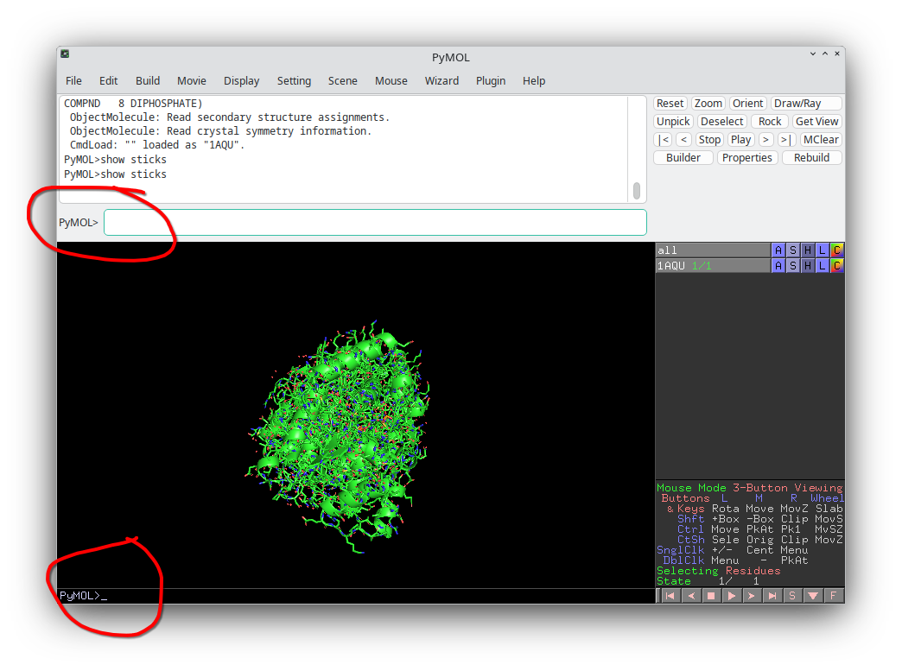

<!--
author: Molecular Modelling Course Team
language: en
narrator: US English Female
version: 1.0

Session 2B: Introduction to Gromacs
Part of: Molecular Modelling and Quantum Chemistry (Master)
-->

[Open this course in LiaScript](https://liascript.github.io/course/?https://raw.githubusercontent.com/conradhuebler/TeacherTwinMolecularModelling/main/session2b_gromacs_intro.md)

# Session 2B: Introduction to Gromacs — Professional Molecular Dynamics

## Welcome to the Industry Standard

> **Session 2A** taught you MD concepts with **Curcuma** (simple, educational).
>
> **Session 2B** introduces **Gromacs** — the most widely used MD software in research.
>
> We follow the **Lemkul workflow** (Lemkul 2024, *J. Phys. Chem. B*):
> a proven, step-by-step approach to running protein simulations.

---

## 🎯 Learning Objectives

By the end of Session 2B, you will:

- ✅ Understand **Gromacs file formats** (.mdp, .top, .gro, .tpr, .edr, .xtc)
- ✅ Know the **Lemkul workflow:** prep → energy min → equil → production
- ✅ Learn to prepare input files for **production-scale** simulations
- ✅ Submit jobs to a cluster (you send inputs, instructor runs them)
- ✅ Analyze Gromacs results (energy, temperature, trajectory)

---

## Part 1️⃣: Gromacs Overview

### What is Gromacs?

**Gromacs** = Groningen Machine for Chemical Simulations

- Powerful open-source MD package
- Used in > 50,000 publications
- Highly optimized for performance
- Supports multiple force fields (CHARMM36, Amber, OPLS, etc.)
- Standard in pharma, academia, biochemistry

**Key advantage:** Gromacs does everything (prep, equil, production, analysis) in one ecosystem.

---

### When to Use Gromacs vs. Curcuma

| Task | Curcuma | Gromacs |
|------|---------|---------|
| **Teaching MD concepts** | ✓✓✓ | ✓✓ |
| **Quick prototyping** | ✓✓✓ | ✓✓ |
| **Production protein MD** | ✓ | ✓✓✓ |
| **Large-scale simulations** | ✗ | ✓✓✓ |
| **Advanced sampling** | ✓ (partial) | ✓✓✓ |
| **Ease of use** | ✓✓✓ | ✓✓ |

**In this course:** You'll prepare Gromacs inputs (which you understand from Curcuma), then the instructor runs production simulations on a cluster.

---

### ✅ Quick Check 1: Gromacs Use Cases

**Question 1:** Which task is Gromacs best suited for?

- [[ ]] Teaching MD to beginners
- [[X]] Running 100 ns simulations of proteins on a cluster
- [[ ]] Quick energy minimization tests
- [[ ]] Simple molecules in vacuum
********************
**Explanation:**
Gromacs is **production-scale MD software**, designed for large, long simulations. **Why the answers:**

- ✅ **Correct:** 100 ns protein simulations on clusters require specialized software with parallelization, energy efficiency, and advanced analysis tools—Gromacs excels here.
- ❌ Teaching beginners: Use **Curcuma** or **xtb** instead (simpler, more intuitive).
- ❌ Quick tests: **Curcuma** or **xtb** are faster for prototyping; Gromacs has setup overhead.
- ❌ Small Molecules in vacuum: For single molecules without solvation, **QM/SQM programs (ORCA, Gaussian, xtb, GAMESS)** or **Curcuma** are better choices. Gromacs expects explicit solvent for realistic dynamics.

**Key insight:** Gromacs is overkill for small systems but essential for production biochemistry simulations.

********************

**Question 2:** Which is a disadvantage of Gromacs compared to Curcuma?

- [[X]] Steeper learning curve with more setup complexity
- [[ ]] Much less accurate results
- [[ ]] Slower for small molecules
- [[ ]] Cannot handle proteins
********************
**Explanation:**

- ✅ **Correct:** Gromacs requires understanding of MDP files, topology generation, solvation, force fields, and ensemble control. Curcuma: single command with reasonable defaults.
- ❌ Less accurate: Gromacs is more accurate as it has well tested force fields.
- ❌ Slower for small molecules: **Curcuma** or **xtb** *are* faster for prototyping, but that's a limitation of starting overhead, not speed.
- ❌ Cannot handle proteins: Gromacs is designed specifically for proteins and other biomolecules.

**Practical tip:** Curcuma for teaching + exploration; Gromacs for publication-ready results.

********************

**Question 3:** Why does this course use BOTH Curcuma and Gromacs?

- [[X]] Learn MD concepts with Curcuma, then apply them professionally with Gromacs
- [[ ]] They use different force fields, and are complementary
- [[ ]] Gromacs cannot do geometry optimization
- [[ ]] Curcuma is required before Gromacs
********************

**Explanation:**
- ✅ **Correct:** Session 2A (Curcuma) builds conceptual understanding; Session 2B (Gromacs) shows how real researchers run simulations. This progression ensures you understand *why* before using complex *how*.

- ❌ Different force fields: While this is true, that is not the key of using both. Curcuma is for small molecules, with ability to use force fields and semiemprical methods. But curcuma is used as easy way to get to know molecular dynamics
- ❌ Gromacs cannot do optimization: Gromacs can minimize, NVT, NPT, and production. Limitation is that this course focuses you on prep → submit workflow.
- ❌ Curcuma required: Technically not required, but pedagogically essential for understanding.

********************

## Part 2️⃣: Gromacs File Formats

Gromacs works with specific file types. Understanding them is **critical**.

### Input Files

| File | Purpose | Format | Example |
|------|---------|--------|---------|
| **.pdb** | Protein structure (from PDB or AlphaFold) | Text | `protein.pdb` |
| **.top** | System topology (atoms, bonds, interactions) | Text | `topol.top` |
| **.itp** | Included topology (force field parameters) | Text | `amber99sb.itp` |
| **.mdp** | MD parameters (all simulation settings) | Text | `minim.mdp` |

### Processing Files

| File | Purpose | Format | Created by |
|------|---------|--------|------------|
| **.gro** | Coordinate file (XYZ with velocities, box) | Text (fixed format) | `gmx pdb2gmx` |
| **.tpr** | Binary run input (combines gro + top + mdp) | Binary | `gmx grompp` |

### Output Files

| File | Purpose | Format | Size |
|------|---------|--------|------|
| **.xtc** | Trajectory (compressed, no velocities) | Binary | Large (~1-100 GB) |
| **.trr** | Trajectory (full precision, with velocities) | Binary | Huge (~10-1000 GB) |
| **.edr** | Energy/temperature/pressure data | Binary | Analyzed with `gmx energy` |
| **.log** | Simulation log (human-readable) | Text | Small (~1-10 MB) |

---

### ✅ Quick Check 2: File Formats

**Question 1:** Which file contains the force field parameters?

- [[ ]] .pdb
- [[ ]] .gro
- [[X]] .top / .itp
- [[ ]] .xtc
********************

**Explanation:**

- ✅ **Correct:** Topology files (.top = main topology, .itp = included topology modules) contain force field parameters: bond strengths, angles, dihedrals, nonbonded interactions. .itp files are often imported from force field databases (AMBER, CHARMM).
- ❌ .pdb: Just coordinates + element types (from PDB database or AlphaFold).
- ❌ .gro: Coordinates + velocities, created *after* topology processing.
- ❌ .xtc: Compressed trajectory (coordinates only, no parameters).

**Key insight:** .top is the "recipe" for your molecule; .gro is just the "photo" of it.

********************

**Question 2:** What does .tpr stand for?

- [[X]] Topology, Positions, and Run parameters
- [[ ]] Trajectory print result
- [[ ]] Total potential representation
- [[ ]] Time-point recording
********************

**Explanation:**

- ✅ **Correct:** .tpr is a **binary preprocessed file** created by `gmx grompp`. It combines:

  1. **Topology** (bonds, parameters from .top)
  2. **Positions** (coordinates from .gro)
  3. **Run parameters** (everything from .mdp file)
  This single file is fed to `gmx mdrun`.
- ❌ Trajectory result: That would be .trr or .xtc (created *after* running mdrun).
- ❌ Total potential: Confusing terminology; .tpr is binary, not a potential-specific file.
- ❌ Time-point recording: Misunderstands file purpose entirely.

**Practical:** Think of .tpr as the "ready-to-run" package. It's binary because Gromacs optimizes it for fast reading during simulation.

********************

**Question 3:** When would you use .trr instead of .xtc?

- [[X]] When you need velocities and forces (full precision MD data)
- [[ ]] Always, because .trr is smaller
- [[ ]] Never, .xtc is always better
- [[ ]] Only for proteins, not other molecules
********************

**Explanation:**

- ✅ **Correct:**

  - **.trr** = full precision, includes velocities & forces, HUGE file size (10-1000 GB for long sims). Use when:
  
    - Restarting simulation from specific frame (need velocities)
    - Advanced analysis requiring forces
    - Publication-quality archival
  - **.xtc** = compressed, coordinates only, manageable size (1-100 GB). Standard for distribution & analysis.
- ❌ .trr always smaller: Opposite! .trr is 10× larger than .xtc.
- ❌ .xtc never good: .xtc is the standard for analysis; .trr is backup/restart.
- ❌ Only for proteins: Both work for any system.

**Real practice:** Most papers use .xtc for analysis, .trr as archive.

********************

---

## Part 2.5️⃣: 🎨 Protein Visualization with PyMOL

**Important:** The `.pdb` file is your input—you need to visualize and validate it before processing with Gromacs. PyMOL is the professional tool for this task.

---

### Why PyMOL for Proteins?

**PyMOL** is the **industry standard** for visualizing protein structures:

- Opens `.pdb` files seamlessly
- Better for proteins than Avogadro (professional-grade)
- Can also open XYZ files (but Avogadro is simpler for that)
- Used in virtually every structural biology paper
- Essential for publication-quality figures

**Quick comparison:**

| Task | Avogadro | PyMOL |
|------|----------|-------|
| **Small molecules (XYZ)** | ✓✓✓ | ✓ |
| **Proteins (PDB)** | ✓ | ✓✓✓ |
| **Ease of use** | ✓✓✓ | ✓✓ |
| **Professional figures** | ✓ | ✓✓✓ |
| **Animation** | ✓✓ | ✓✓✓ |

**When to use PyMOL:**

- Visualizing protein structures (your case here!)
- Creating publication-quality images
- Animating trajectories
- Coloring by properties (confidence, flexibility, etc.)

---

### Loading PDB Files in PyMOL

**Launch PyMOL with your structure:**

```bash
# Open directly from command line
pymol protein.pdb

# Or open from within PyMOL:
# File → Open → select `.pdb` file
```

**What you'll see:** 3D protein structure with interactive controls.

**First visual check:** Does it look like a protein? (folded, not random? no obvious gaps?)

---

### Navigation Controls

Master these three mouse controls:

- **Left-click + drag:** Rotate structure (rotate view around all axes)
- **Right-click + drag:** Zoom in/out (drag away from you = zoom out, toward you = zoom in)
- **Middle-click + drag:** Pan (move view sideways)
- **Scroll wheel:** Change render fog -> Just try it out

**Pro tip:** Try rotating a structure slowly to see all angles. This reveals "hidden" parts of the structure you might not notice from one view.

---

### Pymol Console

Pymol can be used with console more effictively





### Display Modes for Proteins

Different displays reveal different information. Switch between them to understand your protein:

#### Cartoon Mode (best for protein backbone)

```
show cartoon              
```

Shows α-helices (spirals) and β-sheets (arrows) clearly. This is usually your default view.

**When to use:** Understanding overall fold, identifying secondary structure elements, presentations.

---

#### Stick Mode (best for active sites and details)

```
show sticks
```

Shows all atoms and bonds. Good for zooming into specific regions (active sites, binding pockets).

**When to use:** Examining details, showing why a region is important, molecular interactions.

---

#### Surface Mode (best for binding pockets)

```
show surface
```

Shows the molecular surface (where proteins contact ligands). Reveals pockets and cavities.

**When to use:** Visualizing where ligands bind, identifying binding sites, showing accessibility.

---

#### Combination Display (professional figures)

***Show cartoon for whole protein, sticks for important region***

- Highlight active site residues 50-100 in chain A

```
show cartoon
show sticks, chain A and resi 50-100     
```

This creates professional figures for presentations.

---

### Coloring by Properties

The real power of PyMOL: **color structures by any property**.

#### Coloring by AlphaFold Confidence (pLDDT)

When you load an AlphaFold-predicted PDB file, confidence scores are stored as B-factor values. Color by this to see which regions are confident:

```
pymol alphafold.pdb

# In PyMOL console: color by confidence (stored in B-factor)
spectrum b, blue_white_red
```

**Interpretation:**
- **Blue:** High confidence (pLDDT > 70) — trust this region
- **White:** Medium confidence (pLDDT 50-70) — proceed with caution
- **Red:** Low confidence (pLDDT < 50) — uncertain prediction

**Why this matters:** You can immediately see which parts of the predicted structure AlphaFold was confident about. High-confidence regions are usually more reliable for design and docking studies.

---

#### Coloring by Secondary Structure

```
color red, ss h              # Helices: red
color yellow, ss s           # Sheets (strands): yellow
color green, ss l            # Loops and coils: green
```

This shows secondary structure elements in different colors. Beautiful for presentations!

---

#### Coloring by Chain

If your protein has multiple chains (subunits):

```
color red, chain A
color blue, chain B
color yellow, chain C
```

Helps distinguish different parts of multi-subunit proteins.

---

#### Hide and Show Selective Regions

Focus on specific parts:

```
hide everything                          
show cartoon, chain A                    
show sticks, chain A and resi 100-150   
```

- Start fresh
- Show only chain A
- Highlight residues 100-150 in sticks


---

### Checking Your Gromacs Input Structures

**This is critical:** Validate your PDB BEFORE submitting to Gromacs!

#### Why Visualize Before Gromacs?

1. **Catch geometry problems early** — Overlapping atoms, missing residues
2. **Verify folding** — Is the protein folded or unfolded?
3. **Check orientation** — Is it positioned reasonably?
4. **Save time** — Bad input = wasted cluster computation

#### Example Quality Checks

**Good sign:**

- Clear secondary structure (helices are spiral-like, sheets are extended)
- Smooth backbone trace
- Realistic atom spacing

**Red flag:**

- Atoms overlapping (touching spheres)
- Backbone broken (chains don't connect)
- Unfolded regions that should be folded
- Missing atoms (gaps in backbone)

If you see red flags, the structure isn't ready for Gromacs. Fix it!

---

### Creating Publication-Quality Figures

You'll want professional-looking images for your presentation. PyMOL can create these easily.

#### Basic High-Quality Rendering

```
set ray_trace_mode, 0       # Enable ray tracing
ray 1200, 800                  # Render at 1200×800 pixels
png figure1.png              # Save as PNG
```

The `ray` command creates photorealistic images (slow but beautiful).

#### Color Preferences for Figures

```
set bg_rgb, 1, 1, 1          # White background (standard for papers)
set ray_shadows, on          # Add shadows (more 3D feel)
```

Much more infos are given Pymol wiki: https://pymolwiki.org/index.php/Ray
---

#### Example Figures You'll Create

In this course, you'll make figures like:

1. **Your input protein** (colored by pLDDT if AlphaFold-derived)
2. **Quality control** (showing that your input is good)
3. **Final presentation figures** (Session 3)

---

### Practical Exercise 1: Load a Protein from PDB & Explore Display Modes

**Task:** Download a real protein structure from the PDB and practice PyMOL basics.

**Steps:**

1. Download a small protein structure from PDB:

   - Go to https://www.rcsb.org/
   - Search for a well-known small protein (e.g., "ubiquitin", "lysozyme", or PDB ID: 1UBQ)
   - Download the PDB file (`.pdb` format)
   - Or use a pre-provided structure if available in your course materials

2. Open in PyMOL:

   ```bash
   pymol protein.pdb
   ```

3. Try different display modes to understand the structure:

   ```
   show cartoon              
   show surface              
   show sticks               
   ```

4. Navigate the structure:

   - **Rotate:** Left-click + drag around
   - **Zoom:** Right-click + drag
   - **Pan:** Middle-click + drag
   - Explore different regions and angles

5. Color by secondary structure:

   ```
   color red, ss h           
   color yellow, ss s        
   color green, ss l         
   ```

6. Create a professional figure:

   ```
   set ray_trace_mode, 1
   ray 1200, 800
   png my_pdb_protein.png
   ```

- **What you're learning:** Real protein structures from the PDB show you authentic protein geometry before you run your Gromacs simulations. This gives you intuition for what "good" structures look like!
- **Pymol has a PDB Fetcher.** Try to load the structure from your PDB Code directly in pymol

---

### Practical Exercise 2: Check Your Gromacs Input PDB

**Task:** Validate your own input structure before Gromacs submission.

**Steps:**

1. Open your prepared `.pdb` file:

   ```bash
   pymol my_protein.pdb
   ```
2. Check geometry visually:
   - Atoms: no obvious overlaps?
   - Backbone: continuous trace?
   - Folding: as expected?
3. Try different display modes:

   ```
   show cartoon
   show surface
   show sticks, resi 1-10      
   ```
4. Look for problems:

   - Large gaps in backbone?
   - Atoms far apart where they should be close?
   - Missing secondary structure?
5. If all looks good: proceed to Gromacs. If not: fix in Avogadro and re-export.

**Documentation:** Take a screenshot of the validated structure for your records!

---

### ✅ Quick Check: PyMOL Basics

**Question 1:** What does `spectrum b, blue_white_red` do in PyMOL?

- [[ ]] Rotates the structure
- [[X]] Colors the structure by B-factor values (pLDDT in AlphaFold structures)
- [[ ]] Changes the background color
- [[ ]] Exports an image
********************

**Explanation:**

- ✅ **Correct:** The `spectrum` command creates a color gradient based on B-factor values. Blue = low values (high confidence in AlphaFold), Red = high values (low confidence). This is how you visualize AlphaFold confidence on your structure!
- ❌ **Rotates:** That's mouse control.
- ❌ **Background:** That's `bg_color` command.
- ❌ **Export:** That's `png` command.

**Practical insight:** This one command shows you everything about AlphaFold confidence in one image. Better than reading numbers!
********************

**Question 2:** Which mouse control zooms in/out in PyMOL?

- [[ ]] Left-click + drag
- [[X]] Right-click + drag
- [[ ]] Middle-click + drag
- [[ ]] Scroll wheel alone
********************

**Explanation:**

- ✅ **Correct:** Right-click + drag is the main zoom control. Drag away = zoom out, drag toward you = zoom in. Scroll wheel also works but is less precise.
- ❌ **Left-click:** Rotates the structure.
- ❌ **Middle-click:** Pans (moves view left/right).
- ❌ **Scroll alone:** Works but less common than right-click drag.

**Memory aid:** In professional 3D software (Maya, Blender, etc.), right-click is always zoom!
********************

**Question 3:** Why should you visualize your structure before submitting it to Gromacs?

- [[X]] To catch geometry problems (overlaps, breaks) and verify the structure is correct
- [[ ]] PyMOL improves the structure
- [[ ]] It's optional but nice to do
- [[ ]] To make it run faster
********************

**Explanation:**

- ✅ **Correct:** Visual inspection catches problems that numbers alone miss. Bad geometry causes Gromacs to crash or give unphysical results. 5 minutes of visualization saves hours of wasted cluster time!
- ❌ **PyMOL improves structure:** PyMOL just displays; it doesn't modify. Avogadro (or other tools) fix structures.
- ❌ **Optional:** This is **essential**, not optional. Every published MD paper checks input structures.
- ❌ **Makes it faster:** Gromacs doesn't know if you visualized. But good input structure → no crashes → saves time!

**Best practice:** Always check visually before computing!
********************

---


## Part 3️⃣: The Lemkul Workflow

The **Lemkul workflow** (from the 2024 paper) is a proven, step-by-step process:

```
1. PREPARATION
   Input: protein.pdb
   ↓
   gmx pdb2gmx  →  topology (.top), gro file
   
2. ENERGY MINIMIZATION
   Input: minim.mdp, topol.top, conf.gro
   ↓
   gmx grompp  →  em.tpr
   gmx mdrun   →  em.trr, em.edr, em.log
   
3. EQUILIBRATION (NVT)
   Input: nvt.mdp, topol.top, em.gro
   ↓
   gmx grompp  →  nvt.tpr
   gmx mdrun   →  nvt.trr, nvt.edr, nvt.log
   
4. EQUILIBRATION (NPT)
   Input: npt.mdp, topol.top, nvt.gro
   ↓
   gmx grompp  →  npt.tpr
   gmx mdrun   →  npt.trr, npt.edr, npt.log
   
5. PRODUCTION MD
   Input: md.mdp, topol.top, npt.gro
   ↓
   gmx grompp  →  md.tpr
   gmx mdrun   →  md.trr, md.edr, md.log
   
6. ANALYSIS
   Input: md.edr, md.xtc
   ↓
   gmx energy   →  energy.xvg (plot)
   gmx rms      →  rmsd.xvg (plot)
   gmx rmsf     →  rmsf.xvg (per-residue flexibility)
```

Each step generates input for the next step. **Very systematic.**

> **💡 See Part 5 for the complete, step-by-step workflow with commands you can copy-paste directly.**

---

### Key Workflow Principles

1. **Energy minimization first** — Remove bad contacts, relax starting structure
2. **NVT equilibration** — Heat system to target T, keep volume constant
3. **NPT equilibration** — Allow volume to equilibrate, adjust box size
4. **Production run** — Long, unbiased simulation at correct conditions
5. **Analysis** — Extract energies, RMSDs, fluctuations from outputs

---

### ✅ Quick Check 3: Workflow Order

**Question 1:** The correct order of Lemkul workflow is:

- [[X]] Minimize → NVT equil → NPT equil → Production
- [[ ]] NVT → Minimize → NPT → Production
- [[ ]] Production → Minimize → Equilibration
- [[ ]] Minimize → Production directly
********************

**Explanation:**

- ✅ **Correct:** This is the thermodynamic sequence:

  1. **Minimize:** Remove bad contacts, relax structure
  2. **NVT:** Heat system to 300K at constant volume (temperature equilibration)
  3. **NPT:** Allow box to adjust to 1 bar at constant temperature (pressure equilibration)
  4. **Production:** Long, unbiased simulation at correct T & P
- ❌ NVT before minimize: Impossible—system still has strain; NVT would crash. Why?
- ❌ Production first: Meaningless—system isn't equilibrated.
- ❌ Skip NPT: Box size would be wrong; pressure artifacts in results.

**Key:** Each step feeds the next. Skip one = simulation fails or unphysical results.

********************

**Question 2:** What happens if you skip energy minimization?

- [[X]] Bad contacts cause simulation to crash or become unstable
- [[ ]] Nothing—it's optional, just slower
- [[ ]] Simulation runs faster
- [[ ]] You cannot create .tpr file
********************

**Explanation:**

- ✅ **Correct:** Unminimized structures have atoms overlapping or too close:

  - Repulsive forces become **enormous** (van der Waals)
  - Simulation explodes (atoms fly apart)
  - NVT/NPT cannot equilibrate
  - Common error message: "Steepest descent not converged," "simulation blew up"
- ❌ It's optional: Wrong—minimization is mandatory in every published workflow.
- ❌ Runs faster: Missing minimization adds 10-20 failed attempts; total time increases.
- ❌ Cannot create .tpr: grompp will still create .tpr even with bad geometry; problem appears during mdrun.

**Lesson:** Minimization is cheap (minutes); failed simulations are expensive (hours wasted).

********************

**Question 3:** Why must NVT equilibration run BEFORE NPT?

- [[X]] System must reach target temperature first, then adjust volume (pressure)
- [[ ]] NPT is more expensive computationally
- [[ ]] The order doesn't matter; they're independent
- [[ ]] NVT creates files that NPT depends on
********************

**Explanation:**

- ✅ **Correct:** Thermodynamic hierarchy:

  - **NVT (constant V):** System can't expand/contract; all heat input increases temperature
  - **NPT (constant P & T):** If you skip NVT, system tries to equilibrate T *and* P simultaneously = chaotic, often unstable
  - **Proper sequence:** NVT first → system reaches 300K → *then* NPT adjusts box → both T & P stable
  - Analogy: Fill balloon with air (heat, NVT), then let it reach pressure equilibrium (NPT).
- ❌ NPT more expensive: Actually the other way—NPT barostat adds some cost, not the reason for order.
- ❌ Order doesn't matter: Would immediately see pressure instability, temperature overshoot.
- ❌ NVT creates files for NPT: Both generate .gro files; order is physics-driven, not file-driven.

**Pro tip:** If your NPT crashes, 90% of the time it's because initial structure wasn't properly NVT-equilibrated.

********************

## Part 4️⃣: MDP Files — The Heart of Gromacs

In contrast to curcuma, where every parameter can be controlled as argument from the command line, in gromacs you will be needing an input file: The **.mdp file** controls everything about your simulation. It's **crucial**.

**💡 Where to Get MDP Files:**

 - **Create them as you go:** Each step in **Part 3** has a heredoc to create the file you need
 - **Full explanations:** See **Part 8** for production-quality templates with detailed comments
 - **This section:** Learn what each parameter means

> **🔗 Connection to Previous Sessions:**
>
> Many of the concepts in MDP files build on what you've already learned:
>
> - **Energy minimization** parameters (Part 4) relate to **Session 1**'s geometry optimization concepts
> - **Thermostat settings** (Part 4) implement the same MD concepts from **Session 2A**
> - You've already used these methods with curcuma—now you'll see how GROMACS configures them

---

### Example: Energy Minimization (minim.mdp)

MDP files control everything about your simulation. Here's what a minimization MDP contains:

**Key sections:**

- **Integrator**: `steep` (steepest descent) or `cg` (conjugate gradient)
- **Convergence**: `emtol` (energy tolerance) determines when to stop
- **Output**: Controls what gets saved and how often

**You'll create complete MDP files in Part 5 using tested templates.**

> **💡 Where to find working MDPs:** See **Part 5** for complete, tested MDP files that you'll use in the workflow.

---

### Example: NVT Equilibration (nvt.mdp)

NVT equilibration requires these key settings:

**Key parameters:**

- `integrator = md` (molecular dynamics, not minimization)
- `tcoupl = V-rescale` (thermostat to reach target temperature)
- `ref_t = 298` (target temperature in Kelvin)
- `pcoupl = no` (no pressure coupling = constant volume)

**You'll create complete MDP files in Part 5 using tested templates.**

---

### Example: NPT Equilibration (npt.mdp)

NPT adds pressure coupling to NVT:

**Key differences from NVT:**

- `pcoupl = C-rescale` (barostat to equilibrate pressure)
- `ref_p = 1.0` (target pressure in bar)
- `continuation = yes` (continues from NVT checkpoint)

**You'll create complete MDP files in Part 5 using tested templates.**

---

### Example: Production Run (md.mdp)

Production MD is your actual data-generating simulation:

**Key differences from equilibration:**

- Much longer duration (e.g., 50 ns vs 100 ps)
- No position restraints (protein can move freely)
- Same temperature/pressure coupling as NPT

**You'll create complete MDP files in Part 5 using tested templates.**

---

### ✅ Quick Check 4: MDP Parameters

**Question 1:** What does `dt = 0.002` mean?

- [[ ]] 0.002 seconds per step
- [[X]] 0.002 picoseconds per step (2 femtoseconds)
- [[ ]] 0.002 nanometers
- [[ ]] Not important
********************

**Explanation:**

- ✅ **Correct:** dt is **time per integration step**. 0.002 ps = 2 fs. Physics requires small timesteps to accurately integrate forces without errors.
- ❌ Seconds: That would be absurdly long (2 million femtoseconds per step!).
- ❌ Nanometers: That's distance, not time. Confusing units.
- ❌ Not important: Wrong—timestep is critical. Too large → simulation explodes; too small → simulation crawls.

**Key:** dt typically ranges 0.5–2 fs for proteins. 2 fs is standard (fast bond vibrations ~0.01 fs, so 2 fs captures them safely).

********************

**Question 2:** In NVT ensemble, which should be "no"?

- [[X]] pcoupl (pressure coupling)
- [[ ]] tcoupl (temperature coupling)
- [[ ]] nstenergy (output frequency)
- [[ ]] integrator
********************

**Explanation:**

- ✅ **Correct:** NVT = **constant Volume**. So:

  - **pcoupl = no** (no pressure control allowed)
  - **tcoupl = MUST be on** (need thermostat to maintain 300K)
  - Volume is fixed → box size doesn't change
- ❌ tcoupl: Wrong—you NEED thermostat in NVT to control temperature.
- ❌ nstenergy: That's output frequency, unrelated to NVT constraint.
- ❌ integrator: That's the algorithm choice (md, steep), doesn't define NVT.

**Tip:** Remember: **NVT = No Pressure coupling. NPT = Pressure coupling ON.**

********************

**Question 3:** If `dt=0.002` ps and you want a 200 ps simulation, what is `nsteps`?

- [[ ]] 200
- [[ ]] 2,000
- [[ ]] 50,000
- [[X]] 100,000
********************

**Explanation:**

- ✅ **Correct:** nsteps = duration / dt = 200 ps / 0.002 ps = **100,000 steps**

  - Verification: 100,000 steps × 0.002 ps/step = 200 ps ✓
- ❌ 200: Confusing nsteps with total time (way too short!).
- ❌ 2,000: Off by factor of 50 (would give only 4 ps).
- ❌ 50,000: Off by factor of 2 (would give 100 ps, not 200 ps).

**Pro skill:** Always verify: **Actual time = nsteps × dt**. This calculation appears in every workflow.

********************

**Question 4:** What does `nstenergy = 1000` control?

- [[X]] Energy data is saved every 1000 steps (every 2 ps)
- [[ ]] Maximum energy allowed in simulation
- [[ ]] Timestep size
- [[ ]] Force calculation frequency
********************

**Explanation:**

- ✅ **Correct:** **nstenergy** = output frequency for energy file (.edr). With dt=0.002:

  - 1000 steps × 0.002 ps/step = 2 ps per energy output
  - You get ~100 energy points for a 200 ps run
  - Too frequent (nstenergy=10) → huge .edr file; too rare (nstenergy=10000) → can't see behavior detail
- ❌ Maximum energy: That would be `emtol` (minimization threshold), not nstenergy.
- ❌ Timestep size: That's `dt`, not nstenergy.
- ❌ Force calculation: Forces recalculated every step regardless of nstenergy; this just controls output.

**Practical:** Use nstenergy=1000 (default). For analysis, you need ~100-200 data points; this gives the right resolution.

********************

## Part 5️⃣: The Complete Lemkul Workflow — Step by Step

> **💡 This is the complete, hands-on workflow.** Follow these steps in order to prepare and run your MD simulation.

> **📁 MDP Files in This Section:**
>
> The MDP files below are the **tested, working versions** you should use. They include:
>
> - Complete parameter sets
> - Trajectory output configuration (creates .xtc files)
> - Values tested by instructors
>
> These are the **only** MDP files you need for the course. Don't modify parameters unless instructed.

---

### Step 1️⃣: Create Topology (pdb2gmx)

**What it does:** Converts PDB to Gromacs format + generates topology and force field parameters.

```bash
gmx pdb2gmx -f protein.pdb -o conf.gro -p topol.top -ff amber99sb
```

**You will be asked, which model for water should be used**

```bash
Select the Water Model:

 1: TIP3P     TIP 3-point, recommended

 2: TIP4P     TIP 4-point

 3: TIP4P-Ew  TIP 4-point optimized with Ewald, recommended 

 4: TIP5P     TIP 5-point (see https://gitlab.com/gromacs/gromacs/-/issues/1348 for issues)

 5: SPC       simple point charge

 6: SPC/E     extended simple point charge

 7: None
```

Stick with one of the recommended models. Write down, which model you chose!

***If everything went fine, something like this will be printed out***

```bash
Total charge 0.000 e

Including chain 1 in system: 1231 atoms 76 residues

Including chain 2 in system: 174 atoms 58 residues

Now there are 1405 atoms and 134 residues

Total mass in system 9609.761 a.m.u.

Total charge in system 0.000 e

Writing coordinate file...

                --------- PLEASE NOTE ------------

You have successfully generated a topology from: protein.pdb.

The Amber99sb force field and the tip3p water model are used.

                --------- ETON ESAELP ------------

GROMACS reminds you: "Friends don't let friends use Berendsen!" (John Chodera (on Twitter))
```


**And the following files are generated:**

- `conf.gro` — Protein coordinates (Gromacs format)
- `topol.top` — System topology with all bonding information
- `posre.itp` — Position restraints file (used in equilibration)

---

### Step 2️⃣: Define Simulation Box (editconf)

**What it does:** Creates a cubic box around the protein with specified padding.

```bash
gmx editconf -f conf.gro -o conf_newbox.gro -c -d 1.0 -bt cubic
```

**Parameters:**

- `-c` — Center the protein
- `-d 1.0` — Add 1.0 nm padding on all sides
- `-bt cubic` — Use a cubic box


```bash
:-) GROMACS - gmx editconf, 2022.4-openSUSE (-:

Executable:   /usr/bin/gmx
Data prefix:  /usr
Working dir:  *************
Command line:
  gmx editconf -f conf.gro -o conf_newbox.gro -c -d 1.0 -bt cubic

Note that major changes are planned in future for editconf, to improve usability and utility.
Read 1405 atoms
Volume: 62.9497 nm^3, corresponds to roughly 28300 electrons
No velocities found
    system size :  3.168  3.487  3.857 (nm)
    diameter    :  4.491               (nm)
    center      :  3.025  2.891  1.503 (nm)
    box vectors :  5.084  4.277  2.895 (nm)
    box angles  :  90.00  90.00  90.00 (degrees)
    box volume  :  62.95               (nm^3)
    shift       :  0.221  0.355  1.743 (nm)
new center      :  3.246  3.246  3.246 (nm)
new box vectors :  6.491  6.491  6.491 (nm)
new box angles  :  90.00  90.00  90.00 (degrees)
new box volume  : 273.54               (nm^3)

GROMACS reminds you: "Programming today is a race between software engineers striving to build bigger and better idiot-proof programs, and the universe trying to build bigger and better idiots. So far, the universe is winning." (Rick Cook)
```


**Output:** `conf_newbox.gro` — Protein centered in box

---

### Step 3️⃣: Add Water (solvate)

**What it does:** Fills the simulation box with water molecules (SPC/E model).

```bash
gmx solvate -cp conf_newbox.gro -cs spc216.gro -o conf_solv.gro -p topol.top
```


```bash
:-) GROMACS - gmx solvate, 2022.4-openSUSE (-:

Executable:   /usr/bin/gmx
Data prefix:  /usr
Working dir:  *************
Command line:
  gmx solvate -cp conf_newbox.gro -cs spc216.gro -o conf_solv.gro -p topol.top

Reading solute configuration
Reading solvent configuration

Initialising inter-atomic distances...

WARNING: Masses and atomic (Van der Waals) radii will be guessed
         based on residue and atom names, since they could not be
         definitively assigned from the information in your input
         files. These guessed numbers might deviate from the mass
         and radius of the atom type. Please check the output
         files if necessary. Note, that this functionality may
         be removed in a future GROMACS version. Please, consider
         using another file format for your input.

NOTE: From version 5.0 gmx solvate uses the Van der Waals radii
from the source below. This means the results may be different
compared to previous GROMACS versions.

++++ PLEASE READ AND CITE THE FOLLOWING REFERENCE ++++
A. Bondi
van der Waals Volumes and Radii
J. Phys. Chem. 68 (1964) pp. 441-451
-------- -------- --- Thank You --- -------- --------

Generating solvent configuration
Will generate new solvent configuration of 4x4x4 boxes
Solvent box contains 31230 atoms in 10410 residues
Removed 4455 solvent atoms due to solvent-solvent overlap
Removed 1359 solvent atoms due to solute-solvent overlap
Sorting configuration
Found 1 molecule type:
    SOL (   3 atoms):  8472 residues
Generated solvent containing 25416 atoms in 8472 residues
Writing generated configuration to conf_solv.gro

Output configuration contains 26821 atoms in 8606 residues
Volume                 :     273.543 (nm^3)
Density                :     988.617 (g/l)
Number of solvent molecules:   8472   

Processing topology
Adding line for 8472 solvent molecules with resname (SOL) to topology file (topol.top)

Back Off! I just backed up topol.top to ./#topol.top.2#

GROMACS reminds you: "Given enough eyeballs, all bugs are shallow." (Linus Torvalds, on the power of open source)
```


- **What happens:** The `topol.top` file is automatically updated with water molecule counts. 
- **Please note**, the reference to *A. Bondi* appearing in the logs. Always track citations and add this reference in your reports.

**Output:** `conf_solv.gro` — Protein + water molecules

### Step 3️⃣ - Visualisation

***Check the structure bevor solvation and after solvation***

```bash
pymol conf.gro conf_solv.gro
```

***You can hide the water molecules and show only the protein***

The letter-buttons can be toggled for all loaded structures or for individually loaded or selected structures. Their puprose are:

- A Action
- S Show
- H Hide
- C Color


---

### Step 4️⃣: Add Ions (genion)

**What it does:** Neutralizes the system by replacing water molecules with counterions.

**First, create the ions.mdp file:**

```bash
cat <<'EOF' > ions.mdp
; ions.mdp - used as input into grompp to generate ions.tpr
integrator  = steep
emtol       = 1000.0
emstep      = 0.01
nsteps      = 50000

nstlist         = 1
cutoff-scheme   = Verlet
ns_type         = grid
coulombtype     = PME
rcoulomb        = 1.2
vdw-modifier    = force-switch
rvdw-switch     = 1.0
rvdw            = 1.2
rlist           = 1.4
pbc             = xyz
EOF
```

**Then add the ions:**

```bash
# Prepare for ion addition
gmx grompp -f ions.mdp -c conf_solv.gro -p topol.top -o ions.tpr

# Add counterions (when prompted, choose SOL for water molecule group to replace)
gmx genion -s ions.tpr -o conf_ions.gro -p topol.top -pname NA -nname CL -neutral
```

```ObjectScript
:-) GROMACS - gmx grompp, 2022.4-openSUSE (-:

Executable:   /usr/bin/gmx
Data prefix:  /usr
Working dir:  *************
Command line:
  gmx grompp -f ions.mdp -c conf_solv.gro -p topol.top -o ions.tpr

Ignoring obsolete mdp entry 'ns_type'

NOTE 1 [file ions.mdp]:
  With Verlet lists the optimal nstlist is >= 10, with GPUs >= 20. Note
  that with the Verlet scheme, nstlist has no effect on the accuracy of
  your simulation.


NOTE 2 [file ions.mdp]:
  You have set rlist larger than the interaction cut-off, but you also have
  verlet-buffer-tolerance > 0. Will set rlist using verlet-buffer-tolerance.

Setting the LD random seed to -606097925

Generated 2145 of the 2145 non-bonded parameter combinations
Generating 1-4 interactions: fudge = 0.5

Generated 2145 of the 2145 1-4 parameter combinations

Excluding 3 bonded neighbours molecule type 'Protein_chain_A'

Excluding 2 bonded neighbours molecule type 'SOL'

Excluding 2 bonded neighbours molecule type 'SOL'
Analysing residue names:
There are:    76    Protein residues
There are:  8530      Water residues
Analysing Protein...
Number of degrees of freedom in T-Coupling group rest is 54870.00

The largest distance between excluded atoms is 0.412 nm
Calculating fourier grid dimensions for X Y Z
Using a fourier grid of 56x56x56, spacing 0.116 0.116 0.116

Estimate for the relative computational load of the PME mesh part: 0.13

This run will generate roughly 2 Mb of data

There were 2 notes

GROMACS reminds you: "Load Up Your Rubber Bullets" (10 CC)
```

```bash
:-) GROMACS - gmx genion, 2022.4-openSUSE (-:

Executable:   /usr/bin/gmx
Data prefix:  /usr
Working dir:  *************
Command line:
  gmx genion -s ions.tpr -o conf_ions.gro -p topol.top -pname NA -nname CL -neutral

Reading file ions.tpr, VERSION 2022.4-openSUSE (single precision)
Reading file ions.tpr, VERSION 2022.4-openSUSE (single precision)
No ions to add, will just copy input configuration.

GROMACS reminds you: "In the End Science Comes Down to Praying" (P. v.d. Berg)
```

**Output:** `conf_ions.gro` — Neutralized system, ready for minimization

---

### Step 5️⃣: Energy Minimization (minim.mdp)

**What it does:** Removes bad atomic contacts and relaxes the initial structure using steepest descent minimization.

**Create the minim.mdp file:**

```bash
cat <<'EOF' > minim.mdp
; minim.mdp - used as input into grompp to generate em.tpr
integrator  = steep         ; Algorithm (steep = steepest descent minimization)
emtol       = 500.0         ; Stop minimization when the maximum force < 500.0 kJ/mol/nm
emstep      = 0.01          ; Minimization step size
nsteps      = 50000         ; Maximum number of (minimization) steps to perform
; Output control
nstxout-compressed      = 5000      ; save compressed coordinates every 10.0 ps
compressed-x-grps       = System    ; save the whole system
; Parameters describing how to find the neighbors of each atom and how to calculate the interactions
nstlist         = 1         ; Frequency to update the neighbor list and long range forces
cutoff-scheme   = Verlet    ; Buffered neighbor searching
ns_type         = grid      ; Method to determine neighbor list (simple, grid)
coulombtype     = PME       ; Treatment of long range electrostatic interactions
rcoulomb        = 1.2       ; Real-space electrostatic cut-off
vdw-modifier    = force-switch
rvdw-switch     = 1.0
rvdw            = 1.2       ; Short-range van der Waals cut-off
rlist           = 1.4
pbc             = xyz       ; Periodic Boundary Conditions in all 3 dimensions
EOF
```

**Then run minimization:**

```bash
gmx grompp -f minim.mdp -c conf_ions.gro -p topol.top -o em.tpr
```

```bash
:-) GROMACS - gmx grompp, 2022.4-openSUSE (-:

Executable:   /usr/bin/gmx
Data prefix:  /usr
Working dir:  /scratch/conrad/Lehre/TUBAFDigital/Protein/1UBQ/blob
Command line:
  gmx grompp -f minim.mdp -c conf_ions.gro -p topol.top -o em.tpr

Ignoring obsolete mdp entry 'ns_type'

NOTE 1 [file minim.mdp]:
  With Verlet lists the optimal nstlist is >= 10, with GPUs >= 20. Note
  that with the Verlet scheme, nstlist has no effect on the accuracy of
  your simulation.


NOTE 2 [file minim.mdp]:
  You have set rlist larger than the interaction cut-off, but you also have
  verlet-buffer-tolerance > 0. Will set rlist using verlet-buffer-tolerance.

Setting the LD random seed to -671354921

Generated 2145 of the 2145 non-bonded parameter combinations
Generating 1-4 interactions: fudge = 0.5

Generated 2145 of the 2145 1-4 parameter combinations

Excluding 3 bonded neighbours molecule type 'Protein_chain_A'

Excluding 2 bonded neighbours molecule type 'SOL'

Excluding 2 bonded neighbours molecule type 'SOL'
Analysing residue names:
There are:    76    Protein residues
There are:  8530      Water residues
Analysing Protein...
Number of degrees of freedom in T-Coupling group rest is 54870.00

The largest distance between excluded atoms is 0.412 nm
Calculating fourier grid dimensions for X Y Z
Using a fourier grid of 56x56x56, spacing 0.116 0.116 0.116

Estimate for the relative computational load of the PME mesh part: 0.13

This run will generate roughly 2 Mb of data

There were 2 notes

GROMACS reminds you: "Physics isn't a religion. If it were, we'd have a much easier time raising money." (Leon Lederman)
```

```bash
gmx mdrun -v -deffnm em
```


**It will take** some seconds or minutes to optimise the structure.

```bash
...
Step= 2226, Dmax= 5.8e-03 nm, Epot= -4.23510e+05 Fmax= 4.84097e+03, atom= 1229
Step= 2228, Dmax= 3.5e-03 nm, Epot= -4.23524e+05 Fmax= 4.77529e+02, atom= 1229

writing lowest energy coordinates.

Steepest Descents converged to Fmax < 500 in 2229 steps
Potential Energy  = -4.2352388e+05
Maximum force     =  4.7752939e+02 on atom 1229
Norm of force     =  1.1387555e+01

GROMACS reminds you: "Therefore, things must be learned only to be unlearned again or, more likely, to be corrected." (Richard Feynman)

```

**Output:**

- `em.gro` — Minimized structure
- `em.xtc` — Minimization trajectory (compressed)
- `em.edr` — Energy data
- `em.log` — Minimization log

#### ✅ Quick Check: Minimization Success

After minimization completes, verify that the energy converged properly:

**1. Check potential energy:**

```bash
echo "Potential" | gmx energy -f em.edr -o potential_em.xvg
```

**What to look for:**

- Final potential energy should be **negative** (e.g., -4.2e5 kJ/mol for a typical protein)
- Energy should **decrease** throughout minimization
- Should reach plateau (convergence)

**2. Plot energy curve:**

```bash
gnuplot -persist -e "plot 'potential_em.xvg' every ::11 with lines title 'Potential Energy'"
```

**Interpretation:**

- ✅ **Good:** Sharp drop followed by plateau (converged)
- ⚠️ **Warning:** Still decreasing at end → extend `nsteps` in minim.mdp and rerun the minimsation
- ❌ **Bad:** Energy increasing → check structure for clashes

**3. Visualize minimized structure in PyMOL:**

```bash
# Load structure first, then trajectory
pymol em.gro em.trr
# Or start with structure and load trajectory in PyMOL console:
# pymol
# > load em.gro
# > load em.xtc
```

**PyMOL tips:**

- Check for any distorted geometry (stretched bonds)
- Compare to input structure: `load conf_ions.gro` then `align em, conf_ions`
- Minimize should fix bad contacts without large structural changes

> **📚 Reference:** For detailed energy analysis theory, see **Part 6: Analysis 3 (Energy Monitoring)**.

---

### Step 6️⃣: NVT Equilibration (nvt.mdp)

**What it does:** Heats the system to 298 K at **constant volume** (100 ps). Protein atoms are held in place with position restraints.

**Create the nvt.mdp file:**

```bash
cat <<'EOF' > nvt.mdp
title                   = NVT equilibration 
define                  = -DPOSRES  ; position restrain the protein
; Run parameters
integrator              = md        ; leap-frog integrator
nsteps                  = 50000     ; 2 * 50000 = 100 ps
dt                      = 0.002     ; 2 fs
; Output control
nstxout                 = 500       ; save coordinates every 1.0 ps
nstvout                 = 500       ; save velocities every 1.0 ps
nstenergy               = 500       ; save energies every 1.0 ps
nstlog                  = 500       ; update log file every 1.0 ps
nstxout-compressed      = 5000      ; save compressed coordinates every 10.0 ps
compressed-x-grps       = System    ; save the whole system
; Bond parameters
continuation            = no        ; first dynamics run
constraint_algorithm    = lincs     ; holonomic constraints 
constraints             = h-bonds   ; bonds involving H are constrained
lincs_iter              = 1         ; accuracy of LINCS
lincs_order             = 4         ; also related to accuracy
; Nonbonded settings 
cutoff-scheme           = Verlet    ; Buffered neighbor searching
vdwtype                 = cutoff
vdw-modifier            = force-switch
ns_type                 = grid      ; search neighboring grid cells
nstlist                 = 10        ; 20 fs, largely irrelevant with Verlet
rvdw-switch             = 1.0
rvdw                    = 1.2       ; short-range van der Waals cutoff (in nm)
rlist                   = 1.4
dispcorr                = no
; Electrostatics
coulombtype             = PME       ; Particle Mesh Ewald for long-range electrostatics
rcoulomb                = 1.2       ; short-range electrostatic cutoff (in nm)
pme_order               = 4         ; cubic interpolation
fourierspacing          = 0.16      ; grid spacing for FFT
; Temperature coupling is on
tcoupl                  = V-rescale ; modified Berendsen thermostat
tc-grps                 = System 
tau_t                   = 1.0
ref_t                   = 298 
; Pressure coupling is off
pcoupl                  = no        ; no pressure coupling in NVT
; Periodic boundary conditions
pbc                     = xyz       ; 3-D PBC
; Velocity generation
gen_vel                 = yes       ; assign velocities from Maxwell distribution
gen_temp                = 298       ; temperature for Maxwell distribution
gen_seed                = -1        ; generate a random seed

EOF
```

**Then run NVT equilibration:**

```bash
gmx grompp -f nvt.mdp -c em.gro -r em.gro -p topol.top -o nvt.tpr
gmx mdrun -v -deffnm nvt
```
**The logs are not printed in that tutorial**

**Output:**

- `nvt.gro` — System at 298 K
- `nvt.xtc` — NVT trajectory (compressed, 10 ps intervals)
- `nvt.cpt` — Checkpoint (contains velocities)
- `nvt.edr` — Energy data

#### ✅ Quick Check: NVT Equilibration

After NVT completes, verify temperature stability and check structural drift:

**1. Check temperature equilibration:**

```bash
echo "Temperature" | gmx energy -f nvt.edr -o temperature_nvt.xvg
gnuplot -persist -e "plot 'temperature_nvt.xvg' every ::11 with lines title 'Temperature'"
```

**What to look for:**

- Temperature should fluctuate around **298 K** (±5 K is normal)
- Should stabilize within first 20-30 ps
- ❌ If temperature drifts significantly → thermostat issue

**2. Calculate RMSD during NVT:**

```bash
# RMSD of backbone atoms relative to starting structure
echo "Backbone Backbone" | gmx rms -s nvt.tpr -f nvt.xtc -o rmsd_nvt_backbone.xvg

# Plot
gnuplot -persist -e "plot 'rmsd_nvt_backbone.xvg' every ::11 with lines title 'RMSD Backbone'"
```

```bash
# RMSD of C-alpha atoms
echo "C-alpha C-alpha" | gmx rms -s nvt.tpr -f nvt.xtc -o rmsd_nvt_ca.xvg

# Plot
gnuplot -persist -e "plot 'rmsd_nvt_ca.xvg' every ::11 with lines title 'RMSD of C-alpha atoms'"
```

**This are short runs, so the following interpretation might not fully hold**

**Interpretation:**

- ✅ **Good:** RMSD rises initially (~0-2 Å), then plateaus
  - Initial rise: protein adjusting to temperature
  - Plateau: structure stable at 298 K
- ⚠️ **Warning:** RMSD > 3 Å → significant conformational change (check if expected)
- ⚠️ **Warning:** No plateau → extend NVT time (increase `nsteps`)

**3. Visualize NVT trajectory in PyMOL:**

```bash
# Load structure first, then trajectory
pymol nvt.gr nvt.xtc
# Or start with structure from minimization:
# pymol em.gro nvt.xtc
```

**PyMOL commands for trajectory analysis:**

```python
# In PyMOL console:
set ray_trace_frames, 1
set cache_frames, 0
# Play trajectory: Movie → Play
# Color by B-factor to see flexible regions
```

**What to observe:**

- Does the protein "breathe" (small fluctuations)?
- Are loop regions more flexible than helices/sheets?
- Any large-scale movements? (not expected during short NVT)

> **📚 Reference:** For detailed RMSD theory and interpretation, see **Part 6: Analysis 1 (RMSD)**.

---

### Step 7️⃣: NPT Equilibration (npt.mdp)

**What it does:** Equilibrates **pressure to 1 bar** at constant temperature (500 ps). Box size is allowed to adjust.

**Create the npt.mdp file:**

```bash
cat <<'EOF' > npt.mdp
title                   = NPT equilibration 
define                  = -DPOSRES  ; position restrain the protein
; Run parameters
integrator              = md        ; leap-frog integrator
nsteps                  = 250000    ; 2 * 250000 = 500 ps
dt                      = 0.002     ; 2 fs
; Output control
nstxout                 = 500       ; save coordinates every 1.0 ps
nstvout                 = 500       ; save velocities every 1.0 ps
nstenergy               = 500       ; save energies every 1.0 ps
nstlog                  = 500       ; update log file every 1.0 ps
nstxout-compressed      = 5000      ; save compressed coordinates every 10.0 ps
compressed-x-grps       = System    ; save the whole system
; Bond parameters
continuation            = yes       ; Restarting after NVT 
constraint_algorithm    = lincs     ; holonomic constraints 
constraints             = h-bonds   ; bonds involving H are constrained
lincs_iter              = 1         ; accuracy of LINCS
lincs_order             = 4         ; also related to accuracy
; Nonbonded settings 
cutoff-scheme           = Verlet    ; Buffered neighbor searching
vdwtype                 = cutoff
vdw-modifier            = force-switch
ns_type                 = grid      ; search neighboring grid cells
nstlist                 = 10        ; 20 fs, largely irrelevant with Verlet scheme
rvdw-switch             = 1.0       ; short-range van der Waals cutoff (in nm)
rvdw                    = 1.2
rlist                   = 1.4
dispcorr                = no
; Electrostatics
coulombtype             = PME       ; Particle Mesh Ewald for long-range electrostatics
rcoulomb                = 1.2       ; short-range electrostatic cutoff (in nm)
pme_order               = 4         ; cubic interpolation
fourierspacing          = 0.16      ; grid spacing for FFT
; Temperature coupling is on
tcoupl                  = V-rescale             ; modified Berendsen thermostat
tc-grps                 = System 
tau_t                   = 1.0
ref_t                   = 298 
; Pressure coupling is on
pcoupl                  = C-rescale 
pcoupltype              = isotropic             ; uniform scaling of box vectors
tau_p                   = 5.0                   ; time constant, in ps
ref_p                   = 1.0                   ; reference pressure, in bar
compressibility         = 4.5e-5                ; isothermal compressibility of water, bar^-1
refcoord_scaling        = com
; Periodic boundary conditions
pbc                     = xyz       ; 3-D PBC
; Velocity generation
gen_vel                 = no        ; Velocity generation is off 
EOF
```

**Then run NPT equilibration:**

```bash
gmx grompp -f npt.mdp -c nvt.gro -r nvt.gro -p topol.top -t nvt.cpt -o npt.tpr
gmx mdrun -v -deffnm npt
```

**Important:** `-t nvt.cpt` continues from the NVT checkpoint (preserves velocities for smooth transition)

**Output:**

- `npt.gro` — System at 298 K and 1 bar
- `npt.xtc` — NPT trajectory (compressed, 10 ps intervals)
- `npt.cpt` — Checkpoint
- `npt.edr` — Energy data

#### ✅ Quick Check: NPT Equilibration

After NPT completes, verify pressure/density equilibration and structural stability:

**1. Check pressure equilibration:**

```bash
echo "Pressure" | gmx energy -f npt.edr -o pressure_npt.xvg
gnuplot -persist -e "plot 'pressure_npt.xvg' every ::11 with lines title 'Pressure'"
```

**What to look for:**

- Pressure should fluctuate around **1 bar** (±100 bar fluctuations are normal!)
- Average should converge to ~1 bar over 500 ps
- ❌ If average pressure >> 1 bar or << 1 bar → barostat issue

**2. Check density equilibration:**

```bash
echo "Density" | gmx energy -f npt.edr -o density_npt.xvg
gnuplot -persist -e "plot 'density_npt.xvg' every ::11 with lines title 'Density'"
```

**Interpretation:**

- Density should stabilize around **1000 kg/m³** (water-based system)
- Box volume adjusts during NPT to achieve target pressure
- Stable density = stable box size = good equilibration

**3. Calculate RMSD during NPT:**

```bash
# RMSD relative to starting structure (from NVT)
echo "Backbone Backbone" | gmx rms -s npt.tpr -f npt.xtc -o rmsd_npt_backbone.xvg

# Plot alongside NVT RMSD for comparison
gnuplot -persist -e "plot 'rmsd_nvt_backbone.xvg' every ::26 with lines title 'NVT RMSD', 'rmsd_npt_backbone.xvg' every ::11 with lines title 'NPT RMSD'"
```

**Interpretation:**

- ✅ **Good:** RMSD similar to NVT end value (protein remains stable)
- ✅ **Good:** Small continued rise (<0.5 Å) as system fully equilibrates
- ⚠️ **Warning:** Large jump in RMSD → pressure adjustment caused structural change
  - Check if biologically reasonable
  - May need longer NPT equilibration

**4. Visualize NPT trajectory in PyMOL:**

```bash
# Load structure first, then trajectory
pymol npt.gro npt.trr
```

**PyMOL analysis:**

```python
# In PyMOL:
# Show box dimensions (changes during NPT)
show cell
# Align frames to remove rotation
intra_fit npt
# Color by secondary structure
color_by_ss
```

**What to observe:**

- Box size should stabilize (visible in PyMOL cell)
- Protein structure should remain intact (no unfolding)
- Water molecules equilibrated around protein

**5. Compare all three stages:**

```bash
# Load all three stages in PyMOL for comparison
pymol em.gro nvt.gro npt.gro
# In PyMOL console: Align to see structural changes
# align nvt, em
# align npt, nvt
```

**Expected progression:**

- **EM → NVT:** Minimal change (just heating)
- **NVT → NPT:** Box size adjustment, protein stable
- **Overall:** RMSD from EM to NPT typically 1-3 Å (normal thermal fluctuation)

> **📚 Reference:** For detailed pressure/density analysis and RMSD theory, see **Part 6: Analysis 1 (RMSD) and Analysis 3 (Energy Monitoring)**.

---

### Step 8️⃣: Production MD (md.mdp)

**What it does:** Long, unbiased production run (50 ns) with no position restraints. This is what you submit to the instructor's cluster.

**Create the md.mdp file:**

```bash
cat <<'EOF' > md.mdp
title                   = MD Simulation 
; Run parameters
integrator              = md        ; leap-frog integrator
nsteps                  = 25000000  ; 2 * 25000000 = 50000 ps (50 ns)
dt                      = 0.002     ; 2 fs
; Output control
nstxout                 = 0         ; suppress bulky .trr file by specifying 
nstvout                 = 0         ; 0 for output frequency of nstxout,
nstfout                 = 0         ; nstvout, and nstfout
nstenergy               = 5000      ; save energies every 10.0 ps
nstlog                  = 5000      ; update log file every 10.0 ps
nstxout-compressed      = 5000      ; save compressed coordinates every 10.0 ps
compressed-x-grps       = System    ; save the whole system
; Bond parameters
continuation            = yes       ; Restarting after NPT 
constraint_algorithm    = lincs     ; holonomic constraints 
constraints             = h-bonds   ; bonds involving H are constrained
lincs_iter              = 1         ; accuracy of LINCS
lincs_order             = 4         ; also related to accuracy
; Neighborsearching
cutoff-scheme           = Verlet    ; Buffered neighbor searching
vdwtype                 = cutoff
vdw-modifier            = force-switch
ns_type                 = grid      ; search neighboring grid cells
nstlist                 = 10        ; 20 fs, largely irrelevant with Verlet scheme
rvdw-switch             = 1.0       ; short-range van der Waals cutoff (in nm)
rvdw                    = 1.2
rlist                   = 1.4
dispcorr                = no
; Electrostatics
coulombtype             = PME       ; Particle Mesh Ewald for long-range electrostatics
rcoulomb                = 1.2       ; short-range electrostatic cutoff (in nm)
pme_order               = 4         ; cubic interpolation
fourierspacing          = 0.16      ; grid spacing for FFT
; Temperature coupling is on
tcoupl                  = V-rescale             ; modified Berendsen thermostat
tc-grps                 = System 
tau_t                   = 1.0
ref_t                   = 298 
; Pressure coupling is on
pcoupl                  = C-rescale 
pcoupltype              = isotropic             ; uniform scaling of box vectors
tau_p                   = 5.0                   ; time constant, in ps
ref_p                   = 1.0                   ; reference pressure, in bar
compressibility         = 4.5e-5                ; isothermal compressibility of water, bar^-1
; Periodic boundary conditions
pbc                     = xyz       ; 3-D PBC
; Velocity generation
gen_vel                 = no        ; Velocity generation is off 
EOF
```

**Then prepare for submission:**

```bash
gmx grompp -f md.mdp -c npt.gro -r nvt.gro -p topol.top -t npt.cpt -o md.tpr
# Now submit md.tpr to instructor for cluster execution
```

**Output:**

- `md.tpr` — Ready for the instructor to run on cluster
- (After instructor runs it: `md.xtc` trajectory, `md.edr` energy, `md.log` log file)

---

### Complete Workflow Summary

```bash
# 1. Create topology from PDB
gmx pdb2gmx -f protein.pdb -o conf.gro -p topol.top -ff amber99sb

# 2. Define box
gmx editconf -f conf.gro -o conf_newbox.gro -c -d 1.0 -bt cubic

# 3. Add water
gmx solvate -cp conf_newbox.gro -cs spc216.gro -o conf_solv.gro -p topol.top

# 4. Add ions (after creating ions.mdp with heredoc above)
gmx grompp -f ions.mdp -c conf_solv.gro -p topol.top -o ions.tpr
gmx genion -s ions.tpr -o conf_ions.gro -p topol.top -pname NA -nname CL -neutral

# 5. Minimize (after creating minim.mdp with heredoc above)
gmx grompp -f minim.mdp -c conf_ions.gro -p topol.top -o em.tpr
gmx mdrun -v -deffnm em

# 6. NVT (after creating nvt.mdp with heredoc above)
gmx grompp -f nvt.mdp -c em.gro -p topol.top -o nvt.tpr
gmx mdrun -v -deffnm nvt

# 7. NPT (after creating npt.mdp with heredoc above)
gmx grompp -f npt.mdp -c nvt.gro -p topol.top -t nvt.cpt -o npt.tpr
gmx mdrun -v -deffnm npt

# 8. Production (after creating md.mdp with heredoc above)
gmx grompp -f md.mdp -c npt.gro -p topol.top -t npt.cpt -o md.tpr
# → Submit md.tpr to instructor
```

---

### ✅ Quick Check 5: Workflow Commands

**Question 1:** The command `gmx grompp` does what?

- [[ ]] Runs MD simulation
- [[X]] Preprocesses inputs (.mdp, .top, .gro) and creates binary .tpr file
- [[ ]] Analyzes trajectory results
- [[ ]] Adds water to the system
********************

**Explanation:**

- ✅ **Correct:** `grompp` = **GROMacs PreProcessor**. It:

  1. Reads .mdp file (simulation settings)
  2. Reads .top file (topology)
  3. Reads .gro file (coordinates)
  4. Creates .tpr file (combined binary ready for mdrun)
  - It validates inputs, checks for errors, pre-processes topology
  - Cannot run without .tpr file from grompp
- ❌ Runs MD: That's `gmx mdrun`, not grompp.
- ❌ Analyzes: That's `gmx energy`, `gmx rms`, etc.
- ❌ Adds water: That's `gmx solvate`, not grompp.

**Key:** `grompp` = prep, `mdrun` = execute.

********************

**Question 2:** What does `gmx mdrun` do?

- [[X]] Runs the actual MD simulation (reads .tpr, creates trajectory)
- [[ ]] Creates topology files
- [[ ]] Analyzes results
- [[ ]] Preprocesses inputs
********************

**Explanation:**

- ✅ **Correct:** `mdrun` = **MD RUN**. It:

  1. Reads .tpr file (from grompp)
  2. Performs integration loop: calculate forces → move atoms → repeat
  3. Produces: .trr/.xtc (trajectory), .edr (energy), .log (output), .cpt (checkpoint)
  - mdrun is the CPU-intensive bottleneck
  - On clusters, mdrun is parallelized (GPU/CPU)
- ❌ Creates topology: Topology created during grompp, not mdrun.
- ❌ Analyzes: That's separate gmx commands (energy, rms, etc.).
- ❌ Preprocesses: That's grompp.

**Pro:** mdrun takes hours/days; grompp takes seconds. If mdrun crashes, problem is usually in structure or .tpr, not mdrun itself.

********************

**Question 3:** If `gmx grompp` fails, which file is most likely missing?

- [[X]] .mdp or .top file
- [[ ]] .xtc trajectory file
- [[ ]] .edr energy file
- [[ ]] .log output file
********************

**Explanation:**

- ✅ **Correct:** grompp **needs inputs**: .mdp, .top, .gro. Missing any one → error.

  - Missing .mdp: "cannot find minim.mdp"
  - Missing .top: "cannot find topol.top"
  - Missing .gro: "cannot find conf.gro"
- ❌ .xtc, .edr, .log: These are **outputs** created *after* mdrun, not needed by grompp.

**Troubleshooting tip:** "grompp failed" → check inputs exist first (`ls -la minim.mdp topol.top conf.gro`).

********************

## Part 6️⃣: Trajectory Analysis Tools

> **🔗 Connection to Previous Sessions:**
>
> After running your MD simulation (Part 5), you need to extract meaningful information from the trajectory. These analysis tools help you answer key questions:
>
> - Did the protein remain stable? (RMSD)
> - Which regions are flexible? (RMSF)
> - What are the dominant conformational changes? (PCA)

---

### Analysis 1: RMSD (Root Mean Square Deviation)

> **🔗 You've already used this!** If you completed Part 5, you calculated RMSD during NVT and NPT equilibration. Here we cover the theory and advanced applications.

#### What is RMSD?

RMSD measures the average distance between atoms in two structures:

$$\text{RMSD} = \sqrt{\frac{1}{N} \sum_{i=1}^{N} |\vec{r}_i(t) - \vec{r}_i^{\text{ref}}|^2}$$

Where:

- $N$ = number of atoms
- $\vec{r}_i(t)$ = position of atom $i$ at time $t$
- $\vec{r}_i^{\text{ref}}$ = reference position (usually t=0)

**Physical meaning:**

- Low RMSD (< 2 Å) → structure stable
- High RMSD (> 5 Å) → major conformational change or unfolding
- Gradual increase → slow structural drift

#### RMSD Workflow with GROMACS

**Step 1: RMSD of backbone atoms**

```bash
echo "Backbone Backbone" | gmx rms -s md.tpr -f md.xtc -o rmsd_backbone.xvg
gnuplot -persist -e "plot 'rmsd_backbone.xvg' every ::5 with lines title 'RMSD per Backbone'"


```

**Step 2: RMSD of C-alpha atoms only**

```bash
echo "C-alpha C-alpha" | gmx rms -s md.tpr -f md.xtc -o rmsd_ca.xvg

gnuplot -persist -e "plot 'rmsd_ca.xvg' every ::5 with lines title 'RMSD per C-alpha'"
# Or export for Python/other tools
```

**Step 3: Interpretation**

- Plot should show initial rise (equilibration), then plateau (stable)
- If no plateau → extend simulation time
- Sudden jumps → conformational transitions or artifacts

#### Practical Exercise 1: RMSD Analysis

**Task:** Calculate RMSD for your protein during the production MD run.

**Steps:**

- 1. Run `gmx rms` on your MD trajectory (both backbone and C-alpha)
- 2. Generate plots showing both
- 3. Describe what you observe:

   - How quickly does RMSD rise initially?
   - Does it plateau by the end?
   - Which atoms move more (backbone vs C-alpha)?

**Interpretation guide:**

- If RMSD plateaus within 100 ps → good equilibration
- If RMSD keeps rising → protein still exploring conformational space (might need longer MD)
- Large difference between backbone and C-alpha RMSD → loop regions moving significantly

> **📚 Reference:** RMSD connects to **Session 2A**:
>
> - You calculated RMSD between optimized structures in Session 2A
> - Now you're tracking RMSD over time during MD
> - Same concept, different application!

---

### Analysis 2: RMSF (Root Mean Square Fluctuation)

#### What is RMSF?

RMSF measures per-residue flexibility over time:

$$\text{RMSF}_i = \sqrt{\frac{1}{T} \sum_{t=1}^{T} |\vec{r}_i(t) - \langle\vec{r}_i\rangle|^2}$$

Where:

- $\langle\vec{r}_i\rangle$ = time-averaged position of atom $i$
- $T$ = number of time frames

**Physical meaning:**

- High RMSF → flexible regions (loops, termini)
- Low RMSF → rigid regions (secondary structures)
- RMSF ≈ experimental B-factors (crystal structure flexibility)

#### RMSF Workflow with GROMACS

**Step 1: Calculate RMSF**

```bash
# RMSF per residue (C-alpha atoms)
echo "C-alpha" | gmx rmsf -s md.tpr -f md.xtc -o rmsf_alpha.xvg -res
gnuplot -persist -e "plot 'rmsf_alpha.xvg' every ::4 with lines title 'RMSF per C-alpha'"

```


```bash
# RMSF per atom (all backbone)
echo "Backbone" | gmx rmsf -s md.tpr -f md.xtc -o rmsf_backbone.xvg
gnuplot -persist -e "plot 'rmsf_backbone.xvg' every ::4 with lines title 'RMSF per Backbone'"
```


**Step 2: Compare with B-factors**

```bash
# Output B-factors from RMSF
echo "C-alpha" | gmx rmsf -s md.tpr -f md.xtc -o rmsf.xvg -oq rmsf_bfactor.pdb -res

# Visualize in PyMOL colored by B-factor (now showing MD flexibility!)
pymol rmsf_bfactor.pdb
# In PyMOL: Color → Spectrum → B-factor 
```

**Step 3: Interpretation**

- Peaks in RMSF → flexible loops
- Low values → alpha-helices, beta-sheets
- Compare to crystallographic B-factors (if available from PDB)

#### Practical Exercise 2: RMSF and Flexibility

**Task:** Analyze which regions of your protein are flexible.

**Steps:**

- 1. Calculate RMSF per residue
- 2. Generate B-factor PDB file from RMSF
- 3. Visualize in PyMOL (color by B-factor)
- 4. Identify:

   - Most flexible regions (high RMSF)
   - Most rigid regions (low RMSF)
   - Are termini more flexible than the core?
   - Are loops between secondary structures flexible?

**Biological interpretation:**

- Flexible loops often involved in substrate binding
- Interface regions might be more flexible than buried core
- Flexible termini often disordered in experiments too

---

### Analysis 3: Energy Monitoring

> **🔗 You've already used this!** If you completed Part 5, you checked energy convergence during minimization and temperature/pressure during equilibration. Here we cover more energy analysis tools.

#### Quick Energy Check

```bash
# Extract potential energy
echo "Potential" | gmx energy -f md.edr -o potential.xvg
gnuplot -persist -e "plot 'potential.xvg' every ::11 with lines title 'Potential'"
```

```bash
# Extract temperature
echo "Temperature" | gmx energy -f md.edr -o temperature.xvg
gnuplot -persist -e "plot 'temperature.xvg' every ::11 with lines title 'Temperature'"
```

```bash
# Extract pressure (NPT only)
echo "Pressure" | gmx energy -f md.edr -o pressure.xvg
gnuplot -persist -e "plot 'pressure.xvg' every ::11 with lines title 'Pressure'"
```

**What to check:**

- Energy should be stable (no drift)
- Temperature should fluctuate around target (298 K)
- Pressure should average around 1 bar (NPT)

---

### Analysis 4: Principal Component Analysis (PCA)

#### What is PCA?

**Motivation:**

MD trajectories contain thousands of atomic coordinates × thousands of time frames = millions of data points. PCA reduces this complexity by identifying the **most important motions**.

**Key idea:**

- Proteins move in high-dimensional space (3N dimensions for N atoms)
- Most motions are small thermal fluctuations (noise)
- A few collective motions dominate (signal)
- PCA extracts these dominant motions

**Analogy:**
Imagine filming a swinging door. You could track every atom, but really just one coordinate matters: the door's angle. PCA finds that "door angle" coordinate automatically!

#### PCA Theory for MD

**Step 1: Covariance Matrix**

After removing translation/rotation, calculate the covariance matrix:

$$C_{ij} = \langle (x_i - \langle x_i \rangle)(x_j - \langle x_j \rangle) \rangle$$

Where:

- $x_i$ = coordinate of atom $i$ (could be x, y, or z)
- $\langle \cdots \rangle$ = time average
- $C_{ij}$ = how much coordinates $i$ and $j$ move together

**Step 2: Diagonalization (Eigenvalue Problem)**

Solve: $C \vec{v}_k = \lambda_k \vec{v}_k$

This gives:

- **Eigenvectors** $\vec{v}_k$ = directions of collective motion (principal components)
- **Eigenvalues** $\lambda_k$ = variance along each direction (motion amplitude)

**Physical Meaning:**

- **Large $\lambda_k$** → important collective motion (e.g., domain opening)
- **Small $\lambda_k$** → thermal noise
- **Few large eigenvalues** → motion dominated by specific modes
- **Many similar eigenvalues** → isotropic random motion

#### PCA Workflow with GROMACS

**Step 1: Generate Covariance Matrix**

```bash
# Extract backbone atoms for PCA
echo "Backbone" | gmx covar -s gro -f md.xtc -o eigenval.xvg -v eigenvec.trr

# This produces:
# - eigenval.xvg: eigenvalue spectrum
# - eigenvec.trr: eigenvector trajectory (3D directions)
```

**Step 2: Project Trajectory onto Principal Components**

```bash
# Project onto first eigenvector (PC1)
echo "Backbone Backbone" | gmx anaeig -s md.tpr -f md.xtc -v eigenvec.trr \
    -first 1 -last 1 -proj pc1_proj.xvg

# Project onto PC1 and PC2 (2D landscape)
echo "Backbone Backbone" | gmx anaeig -s md.tpr -f md.xtc -v eigenvec.trr \
    -first 1 -last 2 -2d pc1_pc2_2dproj.xvg
```

**Step 3: Generate Extreme Structures**

```bash
# Create trajectory showing motion along PC1
echo "Backbone Backbone" | gmx anaeig -s md.tpr -f md.xtc -v eigenvec.trr \
    -first 1 -last 1 -extr pc1_extreme.pdb -nframes 30
```

**Step 4: Visualize Principal Components**

```bash
# Create filtered trajectory (only PC1-3 motions, removes thermal noise)
echo "Backbone Backbone" | gmx anaeig -s md.tpr -f md.xtc -v eigenvec.trr \
    -first 1 -last 3 -filtered pc1-3_filtered.xtc
```

#### Interpreting PCA Results

**1. Eigenvalue Spectrum**

Plot `eigenval.xvg`:

```bash
gnuplot -persist -e "plot 'eigenval.xvg' every ::26 with lines title 'Eigenvalue Spectrum'"
# Or use Python/other tools
```

**What to look for:**

- **Steep drop** after first few eigenvalues → motion dominated by few modes
- **Gradual decay** → many modes contribute equally (less structured motion)
- **Cumulative variance:** First 3 PCs typically capture 60-80% of total motion

**Example interpretation:**

- PC1 has $\lambda_1$ = 50 nm² → dominant motion (e.g., hinge bending)
- PC2 has $\lambda_2$ = 20 nm² → secondary motion (e.g., loop reorientation)
- PC3-10 have $\lambda_k$ < 5 nm² → mostly thermal noise

**2. 2D Projections (Conformational Landscape)**

Plot PC1 vs PC2:

```bash
gnuplot -persist -e "plot 'pc1_pc2_2dproj.xvg' every ::26 with points title 'PC1 vs PC2'"
```

**What to look for:**

- **Clusters** → stable conformational states
- **Linear trajectory** → directed transition (e.g., open → closed)
- **Circular/diffuse cloud** → random sampling (well-equilibrated)

**3. Extreme Structures (Motion Visualization)**

Open in PyMOL:

```bash
pymol pc1_extreme.pdb
# Play animation to see motion along PC1
# Frame 1 = one extreme, Frame 30 = other extreme
```

**What to look for:**

- Does PC1 represent a biologically relevant motion?
- Which residues move the most?
- Identify domains or regions involved in motion
- Compare to known conformational changes in literature

**4. Filtered Trajectory**

Visualize only collective motions (no thermal noise):

```bash
pymol pc1-3_filtered.xtc
# This trajectory shows only dominant modes
# Much cleaner than the full MD trajectory!
```

#### Connection to Previous Sessions

> **🔗 Reference:** PCA builds on concepts from earlier sessions:
>
> - **Session 1**: Geometry optimization found local minima. PCA finds pathways between them!
> - **Session 2A**: RMSD measured overall displacement. PCA identifies *which* motions contribute most!
> - You've already generated MD trajectories—now extract the biologically relevant motions.

#### Practical Exercise 3: PCA on Your Protein

**Task:** Perform PCA on your production MD trajectory from Part 5.

**Steps:**

1. Generate covariance matrix with `gmx covar` (backbone atoms recommended)
2. Extract first 3 eigenvectors with `gmx anaeig`
3. Create 2D projection plot (PC1 vs PC2)
4. Generate extreme structures for PC1 and visualize in PyMOL
5. Examine the eigenvalue spectrum
6. **Interpret:** What motion does PC1 represent? Is it biologically relevant?

**Deliverables:**

- Plot of eigenvalue spectrum (first 10 eigenvalues)
- 2D plot of PC1 vs PC2 projections
- Description of PC1 motion (what is your protein doing?)
- Screenshot of PC1 extreme structures in PyMOL

**Discussion points:**

- How much of the total variance is captured by PC1, PC2, PC3?
- Is the motion you observe biologically relevant?
- Could you relate it to the protein's function?

---

### ✅ Quick Check 9: Trajectory Analysis

**Question 1:** If RMSD increases steadily throughout your 100 ps simulation, this suggests:

- [[ ]] Perfect equilibration
- [[X]] Structural drift or slow conformational change
- [[ ]] The thermostat is working correctly
- [[ ]] Nothing unusual (this is expected)
********************

**Explanation:**

- ✅ **Correct:** Continuous RMSD increase indicates the protein is exploring new conformations (dynamic!) or hasn't fully equilibrated. Not necessarily bad—depends on whether the structure is stable (no crashes) and whether the motion makes biological sense.
- ❌ **Perfect equilibration:** Equilibration would show RMSD rising steeply at first, then plateauing.
- ❌ **Thermostat working correctly:** Thermostat controls temperature, not RMSD directly.
- ❌ **Expected:** Could be, but requires investigation—plot the RMSD curve to assess.

**Pro tip:** Compare to crystal structures: does your MD conformation match experimental data or known conformational states?


<details>
<summary>💡 Need more context?</summary>

RMSD tells you "how far is the protein from its starting point?" A rising RMSD means atoms are moving away over time. This could be:
1. **Good:** Sampling different conformational states (dynamic)
2. **Bad:** Structural drift due to bad equilibration

Check the RMSD curve shape to distinguish!

</details>
********************
---

**Question 2:** High RMSF values in your protein are expected at:

- [[X]] Loop regions and termini
- [[ ]] Alpha-helices
- [[ ]] Beta-sheets
- [[ ]] Catalytic residues (always rigid)
********************

**Explanation:**

- ✅ **Correct:** Secondary structures (helices, sheets) form stable hydrogen bond networks, keeping RMSF low. Loops and chain termini lack these constraints, so they fluctuate more. This is expected and normal!
- ❌ **Helices:** Their hydrogen bonds keep them rigid (low RMSF).
- ❌ **Sheets:** Similarly stable due to inter-strand H-bonds.
- ❌ **Catalytic residues:** They can be flexible if not directly involved in catalysis. Active sites vary!

**Practical insight:** High RMSF regions are often where substrate binding occurs—flexibility allows accommodation!

**Pro tip:** Use RMSF to predict functional regions. High RMSF often indicates substrate-binding pockets or allosteric sites.


<details>
<summary>💡 Need more context?</summary>

Think about protein architecture: secondary structures are "locked in" by hydrogen bonds. Loops between them have no such constraints and wiggle freely. This makes loops good candidates for dynamic function!

</details>
********************
---

**Question 3:** In PCA, the first principal component (PC1) represents:

- [[ ]] Random thermal noise
- [[X]] The direction of maximum variance (most important motion)
- [[ ]] The least important motion
- [[ ]] The time-averaged structure
********************

**Explanation:**

- ✅ **Correct:** By definition, PC1 is the eigenvector with the largest eigenvalue, meaning it captures the most variance (motion) in the system. This is usually the most biologically relevant motion!
- ❌ **Random noise:** That would be PCN (last components with small eigenvalues).
- ❌ **Least important:** Opposite—PC1 is most important.
- ❌ **Time-averaged structure:** That's not what eigenvectors represent.

**Connection to physics:** Eigenvalue = variance = "how much does this motion happen?" Largest eigenvalue = most frequent motion.

**Pro tip:** Focus your interpretation on PC1, PC2, PC3. They usually account for 70-90% of all motion!


<details>
<summary>💡 Need more context?</summary>

Eigenvectors ranked by their eigenvalues (largest first). PC1 has the biggest eigenvalue = captures the most variance = most important motion. It's like: "If I had to describe the protein's motion with one number, what number would be most informative?" That's PC1.

</details>
********************
---

**Question 4:** If your eigenvalue spectrum shows 20 large eigenvalues of similar magnitude, this suggests:

- [[ ]] Highly structured, simple collective motion
- [[ ]] Simulation failed
- [[X]] Many different modes contribute equally (complex/flexible system)
- [[ ]] Perfect sampling
********************

**Explanation:**

- ✅ **Correct:** A "democratic" eigenvalue distribution (many similar values) means the protein doesn't have one dominant motion—many different modes are important. This happens for:
  - Large flexible proteins
  - Systems with multiple independent domains
  - Well-sampled, heterogeneous conformational ensembles
- ❌ **Structured simple motion:** That would show 1-3 large eigenvalues, then a sharp drop.
- ❌ **Simulation failed:** The spectrum would be flat (numerical error) or show no structure.
- ❌ **Perfect sampling:** Multiple important modes suggests you might need even *longer* MD to fully explore!

**Interpretation:** Don't despair! This is actually rich information. Your protein is exploring a complex conformational space.

**Pro tip:** Focus on the cumulative variance: how many PCs needed to capture 80% of motion? Many = complex dynamics!


<details>
<summary>💡 Need more context?</summary>

Compare two scenarios:
1. Sharp drop: λ₁ >> λ₂ >> λ₃ ≈ 0 → one dominant motion (hinge-like protein)
2. Gradual decay: λ₁ > λ₂ > λ₃ > ... > λ₂₀ ~ λ₂₁ → many important modes (flexible/complex)

Both are valid—they tell you about your protein's dynamics!

</details>

********************
---

## Part 7️⃣: Your Role in This Course

### What YOU Will Do

1. **Prepare inputs** (MDP + topology using templates)
2. **Create `.tpr` files** (using `gmx grompp`)
3. **Send `.tpr` + `.gro` files** to the instructor
4. **Instructor runs on cluster** (Gromacs mdrun)
5. **Get back results** (.xtc, .edr, .log)

### MDP Templates (Copy-Paste Ready)

**You'll get templates like these** — fill in blanks, use for your protein:

```bash
# Template: energy minimization
gmx grompp -f minim.mdp -c conf_ions.gro -p topol.top -o em.tpr

# Template: NVT (100 ps, 300 K)
gmx grompp -f nvt.mdp -c em.gro -p topol.top -o nvt.tpr

# Template: NPT (100 ps, 300 K, 1 bar)
gmx grompp -f npt.mdp -c nvt.gro -p topol.top -t nvt.cpt -o npt.tpr

# Template: Production (500 ps, 300 K, 1 bar)
gmx grompp -f md.mdp -c npt.gro -p topol.top -t npt.cpt -o md.tpr
```

**Your submission:**

```
session3_inputs/
├── protein_name.pdb          (from AlphaFold or PDB)
├── minim.mdp
├── nvt.mdp
├── npt.mdp
├── md.mdp
└── em.tpr, nvt.tpr, npt.tpr, md.tpr  (created by gmx grompp)
```

---

### Instructor's Role

1. Takes your `.tpr` files
2. Runs production MD on cluster
3. Returns `.xtc`, `.edr`, `.log`
4. You analyze the results in Session 3

**Why this division?** MD runs are **computationally expensive**. You learn the workflow; cluster runs the heavy computation.

---

### ✅ Quick Check 6: Your Workflow

**Question 1:** In this course, what do you do with Gromacs?

- [[X]] Prepare inputs and create .tpr files
- [[ ]] Run full production simulations
- [[ ]] Only analyze results
- [[ ]] Nothing (only Curcuma)
********************

**Explanation:**

- ✅ **Correct:** Your role is **input preparation**:

  1. Write/modify MDP files
  2. Run `gmx grompp` to create .tpr files
  3. Submit .tpr + .gro files to instructor
  4. Instructor runs `gmx mdrun` on cluster
  5. You analyze results (Session 3)
- ❌ Run full simulations: That's on the cluster (computationally expensive, requires HPC resources).
- ❌ Only analyze: You need to understand prep—analysis is just the final step.
- ❌ Nothing: Gromacs input preparation is 30% of the learning.

**Why this split?** Production MD for 500+ ps takes 8-48 CPU hours. Teaching lab computers can't spare that. You learn the workflow; cluster runs the heavy compute.

********************

**Question 2:** What files do you submit to the instructor?

- [[X]] .tpr files (and MDP templates for documentation)
- [[ ]] Only .pdb files
- [[ ]] .xtc trajectory files
- [[ ]] Analyzed results
********************

**Explanation:**

- ✅ **Correct:** You submit:

  - **.tpr files** (em.tpr, nvt.tpr, npt.tpr, md.tpr) — ready to run with mdrun
  - **.mdp files** (optional but good for documentation)
  - **.gro file** (em.gro or nvt.gro, starting coords for next step)
  - **.top file** (topology, so instructor can verify system is correct)
- ❌ .pdb: Already used to create .gro; not needed for submission.
- ❌ .xtc: You don't have it yet—it's created *by* mdrun on the cluster.
- ❌ Analyzed results: That's for *after* you get results back.

**Submission checklist:** `ls -la *.tpr *.mdp *.gro topol.top` — should see 4 .tpr files + topology.

********************

**Question 3:** Why doesn't the course have you run mdrun?

- [[X]] Computationally expensive; requires HPC cluster resources
- [[ ]] mdrun is too difficult to use
- [[ ]] Gromacs is unavailable on your computer
- [[ ]] It's not important for learning
********************

**Explanation:**

- ✅ **Correct:** Production MD is computationally expensive:

  - 500 ps simulation = 250,000 timesteps
  - Each timestep = calculate forces for ~100,000 atoms
  - Total: ~25 billion force calculations
  - On single CPU: 24-48 hours
  - On cluster GPU: 2-8 hours (still significant)
  - Teaching lab: finite compute budget; can't waste on individual runs
- ❌ Too difficult: mdrun is actually simple—`gmx mdrun -v -deffnm prod`—one command!
- ❌ Unavailable: Gromacs can be on your computer; limitation is CPU time, not access.
- ❌ Not important: This is where the real computation happens; you're missing nothing conceptually, just not waiting 8 hours.

**Industry practice:** You prep inputs locally; submit to HPC cluster; get results back. You're learning the real workflow.

********************

## Part 8️⃣: Parameter Guide — Choosing Values

### Time Step (dt)

**Rule of thumb:** Smaller dt = more stable, but slower

- **2 fs (0.002 ps)** — Default for proteins, usually stable
- **1 fs (0.001 ps)** — If system unstable or RATTLE constraints
- **0.5 fs** — Only if serious problems

**For this course:** Use **2 fs** (standard).

---

### Coupling Times

**Thermostat coupling time (tau-t):**

- Small (0.05 ps) — Strong coupling, artificial but stable
- Medium (0.1 ps) — Good balance
- Large (0.5 ps) — Weak coupling, more realistic but slower

**For this course:** Use **0.1 ps** (recommended in literature).

---

### Run Duration

**How long should you simulate?**

| System | Typical Duration |
|--------|------------------|
| Small peptide (5 AA) | 10-50 ps |
| Medium protein (100 AA) | 100-500 ps |
| Large protein (500 AA) | 500 ps - 1 ns |
| Protein complex | 1-10 ns |
| Real production | 10 ns - 1 µs |

**For this course:**

- Equilibration: **100 ps each** (NVT + NPT)
- Production: **[EXPECTED_PRODUCTION_LENGTH_PLACEHOLDER]** ps

---

### Temperature & Pressure

**Temperature:** Always **300 K** (room temperature, ~27°C)

**Pressure:** Always **1.0 bar** (1 atmosphere)

---

### ✅ Quick Check 7: Parameters

**Question 1:** Which dt is most stable for protein MD?

- [[ ]] 0.1 ps
- [[X]] 0.002 ps (2 fs)
- [[ ]] 0.5 ps
- [[ ]] 0.0001 ps (overkill)
********************

**Explanation:**

- ✅ **Correct:** 0.002 ps (2 fs) is the **standard** for protein MD:

  - Bond vibrations ~0.01 fs frequency → need dt << 0.01 fs to capture
  - 2 fs = 200× smaller than frequency → safe margin
  - Faster than needed (gives room for error), but not wasteful
- ❌ 0.1 ps: Way too large! Forces change dramatically in 100 fs. Simulation becomes unstable, diverges.
- ❌ 0.5 ps: Even worse (500× larger than needed).
- ❌ 0.0001 ps: Technically stable but 20× overkill. Simulation runs 20× slower for no added accuracy.

**Trade-off:** dt=2fs = **Goldilocks zone** → stable, reasonable speed.

********************

**Question 2:** If `dt=0.002` ps and `nsteps=50000`, how long is the simulation?

- [[ ]] 10 ps
- [[ ]] 50 ps
- [[X]] 100 ps
- [[ ]] 250 ps
********************

**Explanation:**

- ✅ **Correct:** Duration = nsteps × dt = 50,000 × 0.002 ps = **100 ps**
  - Verification: 50,000 × 0.002 = 100 ✓
  - This is exactly NVT equilibration time in Lemkul workflow
- ❌ 10 ps: Off by factor of 10 (nsteps would be 5,000).
- ❌ 50 ps: Off by factor of 2 (nsteps would be 25,000).
- ❌ 250 ps: That would be nsteps=125,000 (production run length).

**Pro skill:** **Time = nsteps × dt**. Always verify. Mistakes here waste huge CPU time.

********************

**Question 3:** What does `tau-t = 0.1` ps control?

- [[X]] How strongly temperature is controlled (thermostat coupling strength)
- [[ ]] Duration of simulation
- [[ ]] Pressure coupling strength
- [[ ]] Output frequency
********************

**Explanation:**

- ✅ **Correct:** **tau-t** = thermostat **coupling time**:

  - Small tau-t (0.05 ps): **Strong coupling**—temperature tightly controlled, artificial but stable. Good for equilibration.
  - Medium tau-t (0.1 ps): **Balance**—realistic dynamics + stability. Recommended for this course.
  - Large tau-t (0.5 ps): **Weak coupling**—more realistic but takes longer to reach target T.
  - Analogy: Like a thermostat in your house: small response time = tight control, large = sluggish response.
- ❌ Duration: That's nsteps × dt, not tau-t.
- ❌ Pressure: That's tau-p, not tau-t.
- ❌ Output: That's nstenergy, nstlog, etc.

**Practice:** Use tau-t = 0.1 ps (default). Changing it affects how quickly system equilibrates, not length of run.

********************

**Question 4:** Decreasing tau-t (e.g., 0.1 → 0.05) means:

- [[X]] Stronger temperature control; system reaches 300K faster
- [[ ]] Weaker temperature control; system heats slower
- [[ ]] Simulation runs shorter
- [[ ]] No effect on equilibration
********************

**Explanation:**

- ✅ **Correct:** Smaller tau-t = faster response to temperature:

  - tau-t=0.05 ps: Thermostat acts every 0.05 ps → tightly constrained
  - tau-t=0.1 ps: Thermostat acts every 0.1 ps → looser control
  - Result: tau-t=0.05 reaches 300K in ~1-2 ps; tau-t=0.1 takes ~5-10 ps
  - Trade-off: Small tau-t is faster but less realistic; large tau-t is slower but more physical
- ❌ Weaker control: Opposite! Smaller tau-t = stronger, tighter coupling.
- ❌ Shorter simulation: tau-t doesn't change nsteps; duration = nsteps × dt, unchanged.
- ❌ No effect: tau-t has major effect on equilibration speed and quality.

**Decision:** For teaching (fast equilibration) → tau-t=0.1 ps (balance). For production (realistic) → tau-t=0.1-0.5 ps (literature values).

********************

## Part 9️⃣: Key Differences from Lemkul Paper

**This course simplifies the Lemkul workflow slightly:**

| Step | Lemkul | This Course |
|------|--------|------------|
| 1. Prep | pdb2gmx, editconf, solvate, genion | [Will be provided] |
| 2. Min | Yes | Yes |
| 3. NVT | Yes (100 ps) | Yes (100 ps) |
| 4. NPT | Yes (100 ps) | Yes (100 ps) |
| 5. Prod | 1 ns | [EXPECTED_PRODUCTION_LENGTH_PLACEHOLDER] |
| 6. Analysis | gmx energy, gmx rms, gmx rmsf | **See Part 6** for complete coverage: RMSD, RMSF, energy monitoring, and PCA |

**Simplifications:**

- We skip some of Lemkul's advanced options (e.g., LINCS constraints)
- Use default Gromacs settings (more robust)
- Shorter runs for teaching (1-2 hours CPU instead of 8+ hours)

---

### ✅ Quick Check 8: Course vs Lemkul

**Question 1:** This course is based on the Lemkul workflow but:

- [[ ]] Skips energy minimization entirely
- [[ ]] Uses Berendsen thermostat only
- [[ ]] Doesn't follow any published protocol
- [[X]] Uses shorter equilibration times for teaching
********************

**Explanation:**

- ✅ **Correct:** Course follows Lemkul's proven 5-step workflow but with teaching modifications:

  - Lemkul: NVT = 100 ps, NPT = 100 ps, Production = 1 ns (appropriate for publication)
  - Course: NVT = 100 ps, NPT = 100 ps, Production = 500 ps (shorter to fit lab time)
  - Rationale: Even 500 ps gives meaningful data for learning; 1 ns is research-grade overkill
- ❌ Skips minimization: Wrong—minimization is **essential** first step.
- ❌ Uses Berendsen: We use **V-rescale** (CSVR), not Berendsen. (Berendsen is older, less accurate.)
- ❌ Doesn't follow protocol: We **strictly** follow Lemkul 2024—one of the most cited MD tutorial papers.

**Key:** Shorter runs ≠ different method. Same workflow, same physics, just adjusted for pedagogical time.

********************

**Question 2:** What does LINCS (mentioned in Lemkul) do?

- [[ ]] Analyzes trajectory results
- [[X]] Constrains bond lengths, allows larger timesteps
- [[ ]] Couples temperature and pressure
- [[ ]] Compresses trajectory files
********************

**Explanation:**
- ✅ **Correct:** **LINCS** = Linear Constraint Solver. It:

  - Fixes bond lengths at their equilibrium values (e.g., C-H always 0.109 nm)
  - Allows dt → 4-5 fs (instead of 2 fs) because fast bond vibrations don't need calculating
  - Reduces computation by ~20%
  - Trade-off: Slightly more artificial dynamics, but standard in production MD
- ❌ Couples T/P: That's thermostats and barostats, not LINCS.
- ❌ Compresses trajectory: That's .xtc format (grompp -o option), not LINCS.
- ❌ Analyzes: That's gmx energy, gmx rms, etc.

**Why we skip LINCS:** It's advanced; default approach (no constraints) is simpler for teaching. Production workflows use LINCS.

********************

**Question 3:** Why does this course use shorter production runs than Lemkul?

- [[ ]] Gromacs can't handle long simulations
- [[ ]] Shorter production is scientifically equivalent to Lemkul
- [[X]] Teaching time constraints; 500 ps still shows meaningful dynamics and equilibration
- [[ ]] Shorter runs are more accurate than longer ones
********************

**Explanation:**

- ✅ **Correct:** Practical trade-off:

  - **500 ps (course):** Shows equilibration of temperature, pressure, energy. Good for understanding dynamics. CPU: ~2 hours.
  - **1 ns (Lemkul):** Shows longer-timescale fluctuations, better statistics. CPU: ~4+ hours.
  - Both are **scientifically valid**; the difference is statistical convergence (more data = lower noise).
  - For learning the workflow: 500 ps is sufficient. For publication: 1 ns is minimum.
- ❌ Shorter = more accurate: Opposite! Longer = more data = lower noise = more reliable averages.
- ❌ Gromacs limitation: Gromacs easily handles 10 ns, 1 µs, 1 ms sims. No technical limit.
- ❌ Equivalent: They're not equivalent—500 ps has ~2× statistical noise vs. 1 ns. But both are educationally valid.

**Insight:** In research, you run **as long as you can afford (CPU time)**. In this course, you learn the **workflow**, not achieve publication-grade convergence.

********************

## Part 1️⃣0️⃣: Summary & Next Steps

### What You Learned

- ✅ Gromacs file formats and workflow
- ✅ MDP parameter files (minimization, NVT, NPT, production)
- ✅ The Lemkul step-by-step protocol
- ✅ How to prepare inputs for cluster submission
- ✅ **Trajectory analysis tools** (RMSD, RMSF, energy monitoring)
- ✅ **Principal Component Analysis (PCA)** for identifying dominant conformational motions
- ✅ **Interpretation of molecular dynamics results** (stability, flexibility, collective motion)
- ✅ Your role: prepare inputs, instructor runs on cluster, you analyze results  

### What You'll Do Next (Session 3)

1. **Get a protein** (from AlphaFold or PDB)
2. **Prepare Gromacs inputs** (MDP files + grompp commands)
3. **Send to instructor** (session3_inputs/ folder)
4. **Instructor runs MD** on cluster (~2-24 hours depending on protein size)
5. **Analyze results** (Part 6 tools):
   - RMSD: Is the protein stable during MD?
   - RMSF: Which regions are flexible?
   - PCA: What are the dominant conformational changes?
6. **Compare:** AlphaFold prediction vs. MD simulation

---

### ✅ Final Quiz: Session 2B

**Question 1:** What does .tpr file contain?

- [[ ]] Just the protein coordinates
- [[X]] Binary combination of topology, coordinates, and all MD settings
- [[ ]] Energy data from simulation
- [[ ]] Trajectory information
********************

**Explanation:**

- ✅ **Correct:** .tpr (Topology, Positions, Run parameters) is the preprocessed binary package:

  1. **Topology** from .top file (bond parameters, force field)
  2. **Positions** from .gro file (atomic coordinates)
  3. **Run parameters** from .mdp file (dt, nsteps, thermostat, etc.)
  - Created by `gmx grompp`, consumed by `gmx mdrun`
  - Single self-contained file; everything mdrun needs is inside
- ❌ Just coordinates: That's .gro or .pdb, not .tpr.
- ❌ Energy data: That's .edr (created *after* mdrun), not input.
- ❌ Trajectory: That's .trr or .xtc (output), not .tpr.

**Key:** Think of .tpr as the "recipe ready for execution."

********************

**Question 2:** In the Lemkul workflow, what comes immediately AFTER energy minimization?

- [[ ]] NPT equilibration (constant pressure phase)
- [[X]] NVT equilibration (constant temperature heating)
- [[ ]] Adding the protein to water
- [[ ]] Production MD
********************


**Explanation:**
- ✅ **Correct:** The Lemkul sequence is:

  1. **Minimize** (em.gro output)
  2. **NVT** (heat minimized structure to 300K, fixed volume) ← comes right after minimization
  3. **NPT** (adjust box to 1 bar pressure)
  4. **Production** (long unbiased simulation)
  - Thermodynamic reason: Must reach target T *before* allowing volume changes
- ❌ NPT: NPT comes *after* NVT (step 4, not step 3).
- ❌ Add water: Water added at the beginning (solvate step), long before minimization.
- ❌ Production: Production comes last (step 5), not immediately after minimize.

**Sequence matters:** Minimize → NVT → NPT → Production. This order is physics-driven, not flexible.

********************

**Question 3:** V-rescale thermostat is equivalent to:

- [[X]] CSVR (from Session 2A)
- [[ ]] Berendsen thermostat
- [[ ]] NVE (no thermostat)
- [[ ]] Langevin dynamics
********************

**Explanation:**

- ✅ **Correct:** V-rescale = **Velocity rescaling** = same as CSVR (Canonical Sampling via Velocity Rescaling) from Session 2A:

  - Both rescale atomic velocities to match target temperature
  - Both are fast, stable, good for equilibration
  - Used in every modern MD protocol
  - Gromacs calls it "V-rescale"; literature calls it "CSVR"—same thing
- ❌ Berendsen: Older thermostat (still used but less accurate). Different algorithm.
- ❌ NVE: That's *no* thermostat (microcanonical, energy conserving). Opposite of what we want.
- ❌ Langevin: Different thermostat (stochastic, adds friction). Different algorithm and dynamics.

**Terminology note:** Name variation between codes is common. V-rescale = CSVR—identical.

********************

**Question 4:** NPT ensemble means constant:

- [[X]] Number of particles, Pressure, and Temperature
- [[ ]] Number, Pressure, and Time
- [[ ]] Number, Volume, and Temperature
- [[ ]] Nothing is constant
********************

**Explanation:**

- ✅ **Correct:** **NPT** = Canonical Isobaric-Isothermal Ensemble:

  - **N** = Number of atoms (fixed; no atoms added/removed)
  - **P** = Pressure (constant at 1 bar; barostat controls)
  - **T** = Temperature (constant at 300K; thermostat controls)
  - **Volume is NOT constant** (allowed to fluctuate to maintain pressure)
  - Contrast: **NVT** = Number, **Volume** (not Pressure), Temperature
- ❌ Number, Pressure, Time: "Time" isn't a thermodynamic variable in ensembles.
- ❌ Number, Volume, Temp: That's **NVT**, not NPT.
- ❌ Nothing constant: Wrong—N, P, T are all controlled.

**Memory aid:** **N** = atomic number (fixed), **P** = pressure, **T** = temperature. Volume adjusts to maintain P.

********************

**Question 5:** Your simulation crashes after 500 MD steps with "LINCS warning: distance constraint." First thing to try?

- [[X]] Reduce dt (timestep), e.g., 0.002 → 0.001 ps
- [[ ]] Increase nsteps
- [[ ]] Change force field (e.g., amber99sb → charmm36)
- [[ ]] Skip NVT equilibration
********************

**Explanation:**

- ✅ **Correct:** LINCS warning = **bond constraint violation** caused by timestep too large:

  - dt=0.002 ps might be too big for your system (forces very large, atoms moving too far)
  - Reduce dt → smaller steps → smoother integration → fixes constraint violations
  - Usually crashes after 500 steps = system instability building up from day 1
  - Solution: Restart with dt=0.001 ps, try again
- ❌ Increase nsteps: Won't help—problem is per-step integration, not number of steps.
- ❌ Change FF: Force fields don't cause LINCS violations (unless structure is wrong); this wastes time.
- ❌ Skip NVT: Wrong—NVT is necessary for proper equilibration. Skipping makes it worse.

**Real troubleshooting:** If it crashes, always check: (1) timestep, (2) starting geometry (was it minimized?), (3) simulation conditions.

********************

**Question 6:** Calculate: If `dt=0.002` ps, `nsteps=50000`, and `nstenergy=500`, how many energy data points do you get?

- [[ ]] 50 data points
- [[X]] 100 data points (simulation is 100 ps, energy saved every 1 ps)
- [[ ]] 100 data points
- [[ ]] 500 data points
********************

**Explanation:**

- ✅ **Correct:** Multiple calculations:

  - Duration: nsteps × dt = 50,000 × 0.002 ps = **100 ps**
  - Energy frequency: nstenergy × dt = 500 × 0.002 ps = **1 ps per save**
  - Data points: Duration / frequency = 100 ps / 1 ps = **100 points**
  - This gives ~100 independent energy values for analysis
- ❌ 50 points: Would need nstenergy=1000 (1000 × 0.002 = 2 ps per save).
- ❌ 500 points: That's nstenergy=100 (100 × 0.002 = 0.2 ps per save)—overkill, huge file.

**Practical:** With ~100 data points, you can see equilibration trends, temperature/pressure stability. For statistical averaging, 100 pts is reasonable (not amazing, but educational).

**Calculation skill:** Know **Duration = nsteps × dt** and **Frequency = nstenergy × dt**. These appear in every MDP file.

********************

## 📚 Resources

- **Gromacs Documentation:** https://manual.gromacs.org/
- **Lemkul GROMACS Tutorials:** https://www.bevanlab.org/static/papers/
- **GROMACS Manual (Nonbonded):** https://manual.gromacs.org/current/user-guide/mdrun-features/nonbonded-interactions.html
- **Force Field References:** CHARMM36, Amber99SB papers

---

## Questions for Live Session

1. Why do we need both NVT and NPT equilibration?
2. What would happen if you skipped energy minimization?
3. How do you choose the coupling times for thermostat/barostat?
4. What's the difference between .xtc and .trr trajectories?
5. If your simulation crashes, what are common reasons?

@include(footer.md)

---

*Session 2B — Introduction to Gromacs*  
*Last updated: November 27, 2025*  
*Course: Microcredential: Modeling interactions of high molecular weight compounds*
